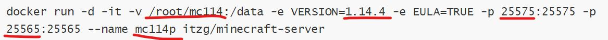

# 使用Docker一键开启我的世界服务器[java/基岩]

## 新服务器无脑开服

Java版本

```shell
yum install docker 
systemctl start docker
docker run -d -it -v /root/mc114_java:/data -e VERSION=1.14.4 -e EULA=TRUE -p 25575:25575 -p 25565:25565 --name mc1144 itzg/minecraft-server
```

基岩版本

```shell
yum install docker 
systemctl start docker
docker run -d -it -v /root/mc114_bedrock:/data -e VERSION=1.14 -e EULA=TRUE --name mc114p -p 19132:19132/udp itzg/minecraft-bedrock-server
```


## 详解解释（以Java为例）

首先第一步安装Docker

```
yum install docker 
```

启动Docker

```
systemctl start docker
```

查看所有docker容器

```
docker ps -a
```

查看服务器日志

```
docker logs <name>/<id前缀>
```

实时日志查看

```
docker logs -f <name>/<id前缀>
```

强制删除服务器

```
docker rm -f <name>/<id前缀>
```

重启服务器

```
docker restart <name>/<id前缀>
```


### 详细开服参数

开服代码可以自定义详细可以参考

[Java版](https://github.com/itzg/docker-minecraft-server)

[基岩版](https://github.com/itzg/docker-minecraft-bedrock-server	)


```
docker run -d -it -v /root/mc114:/data -e VERSION=1.14.4 -e EULA=TRUE -p 25575:25575 -p 25565:25565 --name mc114p itzg/minecraft-server
```




修改服务器配置文件或者自定义服务器配置文件

```
server.properties
```

具体的可以自行搜索，对应的文件在映射的文件夹内

```
#Minecraft server properties
#Tue May 05 14:16:10 GMT 2020
spawn-protection=16
max-tick-time=60000
query.port=25565
generator-settings=
force-gamemode=false
allow-nether=true
enforce-whitelist=false
gamemode=survival
broadcast-console-to-ops=false
enable-query=false
player-idle-timeout=0
difficulty=easy  #难度
spawn-monsters=true
broadcast-rcon-to-ops=true
op-permission-level=4
pvp=true
snooper-enabled=true
level-type=default
hardcore=false
enable-command-block=true
max-players=20
network-compression-threshold=256
resource-pack-sha1=
max-world-size=29999984
function-permission-level=2
rcon.port=25575
server-port=25565
texture-pack=
server-ip=
spawn-npcs=true
allow-flight=true
level-name=hahaha
view-distance=10
resource-pack=
spawn-animals=true
white-list=false
rcon.password=<替换成你的密码>
generate-structures=true
max-build-height=256
online-mode=false
level-seed=-6922807177869922340  #种子
prevent-proxy-connections=false
use-native-transport=true
enable-rcon=true
motd=haha

```