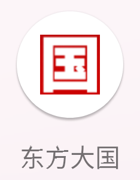
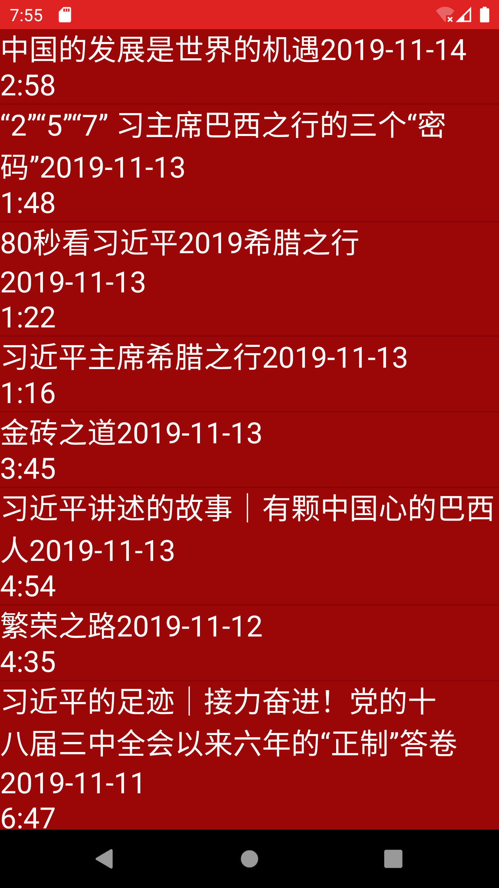
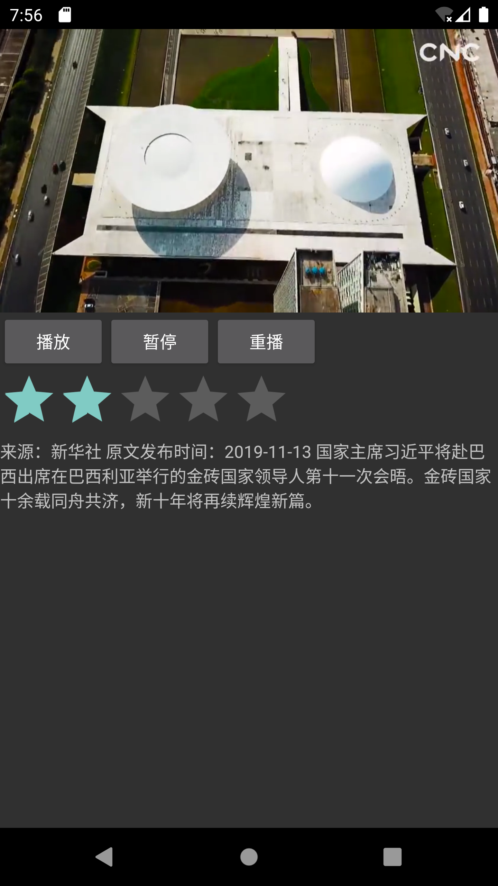
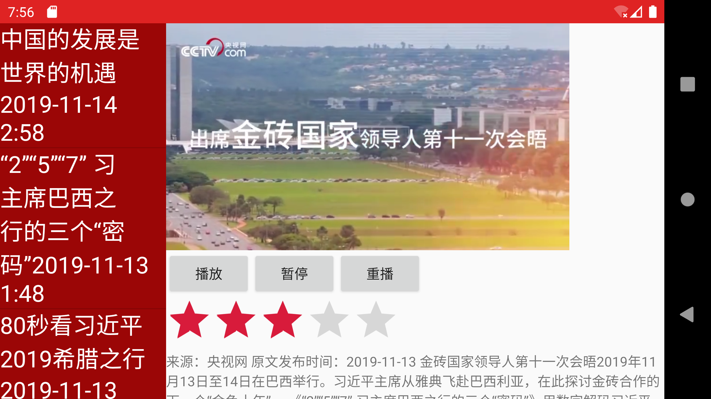
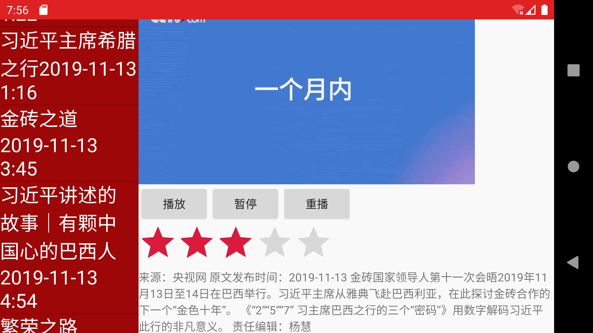

# 东方大国app开发
嘻嘻嘻只是一次作业而已啦，不过真的挺好

本项目地址  
 [https://github.com/whp98/DFDG_app](https://github.com/whp98/DFDG_app)
# 开发任务

- [x] 实现首页（app着陆页），应包含体现主题的app标题、背景图等


- [x] 使用Fragment实现列表Activity与详情Activity，在不同屏幕大小的虚拟设备上可自动切换两种显示方式

  - [x] 大屏：列表、详情同屏显示，左侧列表，右侧详情
  - [x] 小屏：列表、详情分开显示

- [x]
  列表Activity显示所选主题的视频列表，包含至少10项以上该主题内容，每项仅需显示文字信息，如：标题文字、视频时长、来源等（无需缩略图）；列表需支持上下滚动
- [x]
  详情Activity播放在列表Activity所点击的视频，包含开始、停止按钮，点击后可控制视频播放与停止。视频应指向xuexi.cn域名下的视频，勿使用本地视频。视频地址获取方法如下：


- [ ]
  学习强国app中，进入视频，点击分享，选择分享给微信好友，选择文件传输助手；在电脑微信端点击文件传输助手中的消息，在浏览器中打开视频链接

- [ ] 或者在电脑端浏览器中直接访问xuexi.cn网站中的视频

 - [x]
    通过上述方法在电脑端浏览器（建议使用谷歌Chrome浏览器）中打开该视频的链接，打开浏览器的开发者工具，定位到视频，获取视频链接，如：https://video.xuexi.com/......mp4

- [x]
  详情Activity包含RatingBar，可允许为每项内容打分，分值进行保存（文件或SharedPreferences）

- [x] 重新进入详情Activity，显示上次分值，并可修改打分
# 选题背景
我国经济蓬勃的发展，习总书记在这方面起着重要作用通过学习习近平总书记的事迹，
够让我们对国家的发展有更加清晰的认识 我本次的选题是 `学习新视界`


# 成果展示

图标页  


着陆页


竖屏列表  


竖屏播放页面  


横屏播放  


列表滚动  


# 实现步骤

## 设计着陆页

着陆页的实现比较简单，比较核心的部分如下：  
定时任务更新textview
```java
TimerTask task = new TimerTask() {
        @Override
        public void run() {
            runOnUiThread(new Runnable() { // UI thread
                @Override
                public void run() {
                    recLen--;
                    tv.setText(skip_ad+recLen);
                    if (recLen < 0) {
                        timer.cancel();
                        tv.setVisibility(View.GONE);//倒计时到0隐藏字体
                    }
                }
            });
        }
    };
```
设定监听器，启动MainActivity
```java
public void onClick(View view) {
        switch (view.getId()) {
            case R.id.tv:
                startActivity(intent);
                finish();
                if (runnable != null) {
                    handler.removeCallbacks(runnable);
                }
                break;
            default:
                break;
        }
    }
```
## MainActivity实现

MainActivity主要就是启动一个frament实例，然后让其余的任务在fragment中完成  
关键部分：  
取得数据
```java
for (int i=0;i<names.length;i++){
            videos.add(new Video(i+1,names[i],contents[i],len[i],url[i]));
        }
```
创建fragment实例并且加载

```java
        //创建2个Fragment的实例
        SetTitleFragment TitleFragment = new SetTitleFragment();
        SetContentFragment ContentFragment = new SetContentFragment();

        //获取Fragment事务
        FragmentManager fragmentManager = getSupportFragmentManager();
        FragmentTransaction transaction = fragmentManager.beginTransaction();


        //添加Fragment
        transaction.replace(R.id.settitle,TitleFragment);
        if (findViewById(R.id.setcontent)!=null) {
            transaction.replace(R.id.setcontent,ContentFragment);
        }
        //提交事务
        transaction.commit();
```
# 用于展示列表的fragment：SetTitleFragment
主要的工作就是显示列表，数据从MainActivity获取，然后在设置另一个fragment的参数，将被选中的项目传过去，
并且在不同的屏幕状态下采取不同的动作  
关键部分  
获取数据
```java
        //从MainActivity获取数据
        MainActivity activity=(MainActivity)getActivity();
        videos = activity.getVideos();
```
判断横屏竖屏

```java
//判断是是不是横屏布局
        if (((MainActivity)getActivity()).findViewById(R.id.setcontent) != null) {
            isTwoPane = true;
        } else {
            isTwoPane = false;
        }
```

创建竖屏展示页面发送数据

```java
Intent intent = new Intent(getActivity().getApplicationContext(), PlayVideoActivity.class);
                    //可以携带数据
                    Bundle data = new Bundle();
                    data.putSerializable("data",videos.get(i));
                    intent.putExtras(data);
                    startActivity(intent);
```

实现adapter的部分

```java
public View getView(int i, View view, ViewGroup viewGroup) {
            // 加载listView每一项的布局
            view = View.inflate(getActivity(), R.layout.title_item_layout, null);

            // 获取title_item_layout中TextView的实例
            TextView titletext = (TextView)view.findViewById(R.id.titles);
            // 为该TextView设置文字为titles中的第i项
            titletext.setText(videos.get(i).toString());
            return view;
        }
```

## SetContentFragment功能较多
主要实现视频播放，视频评价，视频详情内容展示

视频播放内容

```java
private void initVideoPath(Video in){
        videoView.setVideoURI(Uri.parse(in.url));//指定视频文件路径
        videoView.setOnPreparedListener(new MediaPlayer.OnPreparedListener() {
            @Override
            public void onPrepared(MediaPlayer mp) {
                mp.setLooping(true);//让电影循环播放
            }
        });
    }
```

视频评价内容存储和设定
```java
ratingBar.setOnRatingBarChangeListener(new RatingBar.OnRatingBarChangeListener() {

            @Override
            public void onRatingChanged(RatingBar ratingBar, float rating, boolean fromUser) {
                if (fromUser){
                    setRate(rating,id_r);
                }
            }
        });
        
 private float getRate(int id){
        SharedPreferences sp = this.getActivity().getSharedPreferences("rates", Context.MODE_PRIVATE);
        return sp.getFloat(""+id,0);
    }

    private void setRate(float rate,int id){
        SharedPreferences sp = this.getActivity().getSharedPreferences("rates", Context.MODE_PRIVATE);
        SharedPreferences.Editor editor = sp.edit();//获取编辑器
        editor.putFloat(""+id,rate);
        editor.apply();//提交修改
    } 
```

视频详情内容展示

```java
public void setText(Video text) {
        this.id_r=text.id;
        // 设置TextView的文字
        initVideoPath(text);
        text1.setText(text.contents);
        ratingBar.setRating(getRate(text.id));
    }
```
## 存储数据的实体类
实现了存储接口可以使用Bundle传输

```java
public class Video  implements Serializable {
    public Integer id;
    public String name;
    public String contents;
    public String len;
    public String url;

    public Video(Integer id, String name, String contents, String len, String url) {
        this.id = id;
        this.name = name;
        this.contents = contents;
        this.len = len;
        this.url = url;
    }

    @Override
    public String toString() {
        return  name+"\n"+len;
    }
}
```

## 视频单独播放
这里有Bundle的数据接收
```java
Intent intent = this.getIntent();
            Video video=(Video) intent.getSerializableExtra("data");
            SetContentFragment ContentFragment = new SetContentFragment();
            ContentFragment.setDef(video);
```

## manifests权限设置

```xml
<uses-permission android:name="android.permission.INTERNET" />
    <uses-permission android:name="android.permission.WRITE_EXTERNAL_STORAGE" />
```

## 布局文件

activity_main主要有横竖两个，横的布局显示两个framelayout而竖屏显示一个  
activity_play_video主要目的是中间嵌套fragmenr所以有有一个framelayout  
activity_start显示的是落地页，中间有图片展示  
content_layout显示的是视频的内容，中间使用滚动和约束布局实现  
title_item_layout主要是Textview用于展示列表  
title_layout中间有一个ListView用来展示title


# 项目心得
本次项目对我安卓开发本领有较大考验，好在最后还是完整的实现了具体的功能。同时学习习近平的事迹也让我，
对祖国的未来和我今后的发展联系在了一起我今后一定为祖国的建设添砖加瓦