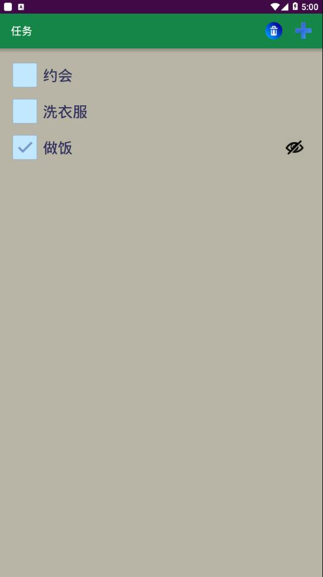
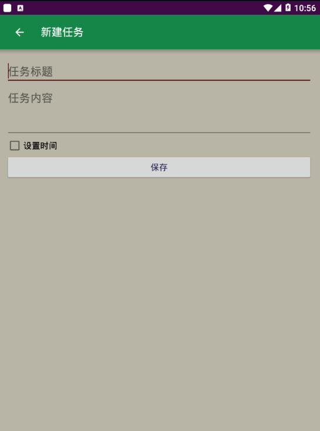
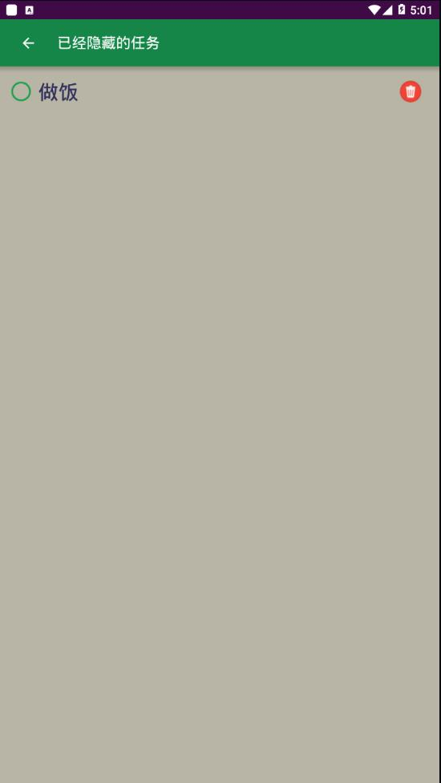
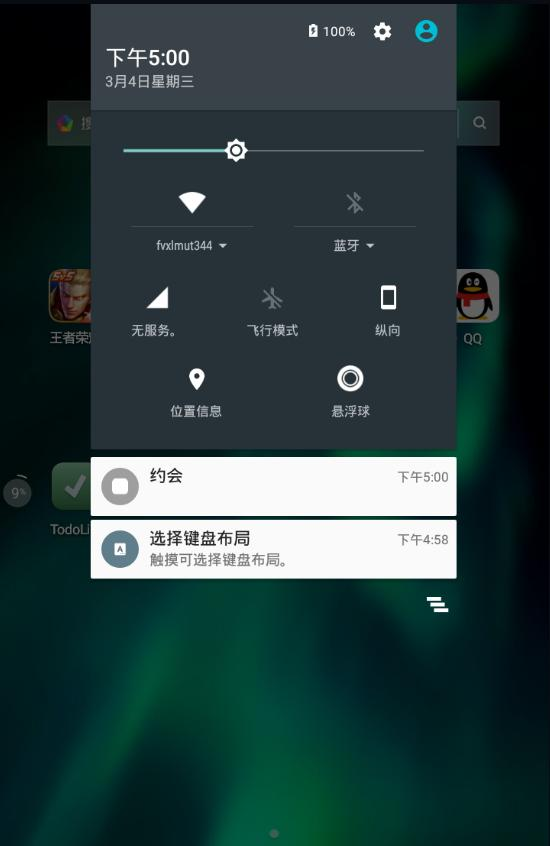

# 在别人代码的基础上做了一个AndroidTodo

一个简单的安卓todo应用，这个应用主要是从一位法国（注释是法语）的安卓开发者哪里来的灵感，我在原来的基础上增加了一个垃圾桶的功能，用户可以隐藏和找回自己已经完成的任务。

首先贴出原作者的仓库地址
https://github.com/KamilMichalski0/TodoListAndroid

本文仓库地址
https://github.com/whp98/TodoListAndroid

~~这里说明一下由于改动了包名所以没脸去原作者那里拉请求，没准后面改回去，本文主要是v1.0.0版本的内容。~~

目前包名已经改回去了，版本是v1.1.0更改了配色，见下文。并且申请和原作者合并，至于它同不同意就是后话了。

## App演示

icon（网上找的非商用）


主界面



创建新的任务



回收站内容



通知栏发送通知



v1.1.0 最新版配色


## 技术实现

主要技术栈：SQLite数据库+Service+菜单设计+通知+复杂Adapter设计

### 数据库

数据库部分主要是一个数据库的操作，为了简化数据库的操作部分和减少数据库操作的失误几率这里使用数据库映射工具来实现数据库的操作，数据库操作主要使用
com.j256.ormlite包来完成
操作数据库的实体类
包含一些数据标记的注解

```java
//任务实例类
@DatabaseTable(tableName = "todo_task")
public class TodoTask {

    @DatabaseField(generatedId = true)
    private int id;
    @DatabaseField(canBeNull = false)
    private String name;
    @DatabaseField
    private String note;
    @DatabaseField(canBeNull = false)
    private boolean done;
    @DatabaseField(canBeNull = false)
    private boolean hiden;
    @DatabaseField(canBeNull = false)
    private Date dateCreated;
    @DatabaseField(canBeNull = false)
    private boolean reminder;
    @DatabaseField
    private Date reminderDate;

```
创建数据库的Helper类，根据实体自重创建数据库
```java
public class TodoDbOpenHelper extends OrmLiteSqliteOpenHelper {

    public static final String DATABASE_NAME = "todo.db";
    public static final int DATABASE_VERSION = 3;

    public TodoDbOpenHelper(Context context) {
        super(context, DATABASE_NAME, null, DATABASE_VERSION);
    }

    @Override
    public void onCreate(SQLiteDatabase database, ConnectionSource connectionSource) {
        try {
            TableUtils.createTable(connectionSource,TodoTask.class);
        } catch (SQLException e) {
            e.printStackTrace();
        }

}
…

```

操作数据库的接口，在另一个类中具体实现数据操作
```java
public interface ITaskDataBase {
    List<TodoTask> getTasks();

    List<TodoTask> getTasksHid();

    List<TodoTask> getFutureTasksWithReminder(Date now);

    void addTask(TodoTask task);

    TodoTask getTask(int position);

    void updateTask(TodoTask task, int position);

    void deleteTask(TodoTask task, int position);
}

```

数据库操作实现实现接口一个方法例子

```java
//不显示隐藏的项目
    @Override
    public List<TodoTask> getTasks() {
        try {
            return mDao.queryBuilder()
                    .orderBy("done",true)
                    .orderBy("dateCreated",false)
                    .where().eq("hiden",false)
                    .query();
        } catch (SQLException e) {
            e.printStackTrace();
    }
        return Collections.emptyList();
    }

```

### Adapter
使用第三方库butterknife来实现绑定控件

```java
@BindView(R.id.task_done)
        CheckBox mDone;
        @BindView(R.id.task_title)
        TextView mTitle;
        @BindView(R.id.todoitem_hiddden)

```
设置数据和数据更新
```java
public void setmTask(List<TodoTask> mTask) {
        this.mTask = mTask;
        notifyDataSetChanged();
}

```

使用viewholder实现控件复用提高性能

```java
@Override
    public TodoViewHolder onCreateViewHolder(ViewGroup parent, int viewType) {
        LayoutInflater inflater = LayoutInflater.from(parent.getContext());
        View rowView = inflater.inflate(R.layout.list_item_todo, parent, false);
        return new TodoViewHolder(rowView);

    }

```
绑定viewholder
```java
@Override
    public void onBindViewHolder(TodoViewHolder holder, int position) {
        TodoTask task = mTask.get(position);
        holder.mBlockListeners=true;
        holder.mCurrentPosition = task.getId();
        holder.mCurrentTask = task;
        holder.mTitle.setText(task.getName());
        holder.mDone.setChecked(task.getDone());
……

```
Bufferknife绑定监听器
```java
@OnClick
        void onItemClick() {
            if (mClickListener != null && !mBlockListeners) {
                mClickListener.onClick(mCurrentTask, mCurrentPosition);
            }
        }

```
定义外部接口，activity实现该接口实现通信
```java
public interface OnClickListener {
        void onClick(TodoTask task, int position);
        void onTaskHiddenChanged(TodoTask task,int position,boolean isHidden);
        void onTaskDoneChanged(TodoTask task, int position, boolean isDone);
    }
```

### 菜单

```xml
<item
        android:id="@+id/hidden_task"
        android:title="@string/menu_done_task"
        android:icon="@drawable/trashbin50px"
        app:showAsAction="ifRoom"/>
    <item
        android:id="@+id/menu_item_create"
        android:title="@string/nemu_add_task"
        android:icon="@drawable/new_menu"
        app:showAsAction="always" />

```
### Service

设置通知的计划，这个任务会将任务交给负责通知的Service
```java
public void planNotifications() {
        List<TodoTask> tasks = mTaskDatabase.getFutureTasksWithReminder(new Date());
        AlarmManager alarmManager = (AlarmManager) mContext.getSystemService(Context.ALARM_SERVICE);
        for (TodoTask task : tasks) {
            Intent serviceIntent = new Intent(mContext, TodoNotificationService.class);
            serviceIntent.putExtra("id", task.getId());
            PendingIntent pendingIntent = PendingIntent.getService(mContext,
                    task.getId(),
                    serviceIntent,
                    PendingIntent.FLAG_UPDATE_CURRENT);
```

### 通知Service

```java
protected void onHandleIntent(Intent intent) {
        int taskId = intent.getIntExtra("id", -1);
        TodoTask task=mTaskDatabase.getTask(taskId);

        if (task==null){return;}

        Notification  notification = new NotificationCompat.Builder(this)
                .setSmallIcon(R.drawable.icon)
                .setContentTitle(mTaskDatabase.getTask(taskId).getName())
                .setContentText(mTaskDatabase.getTask(taskId).getNote())
                .setDefaults(NotificationCompat.DEFAULT_ALL)
                .setTicker(task.getName())
                .setPriority(NotificationCompat.PRIORITY_MAX)
                .build();

```

## 总结

这篇内容主要是2019年的老东西了，这个还是要反思一下当初做的时候为啥没有写文档。现在这篇介绍文档肯定没有当初写的好。
还有就是技术栈的问题，之前的我的东西都是自己搞出来的，我发现这个老外使用了很多开源的东西来帮助自己开发，这些让开发变得方便快捷是我应该学习的。
在前面的人的基础上对代码进行改进或者按照自己需求改动确实也能学到很多东西。