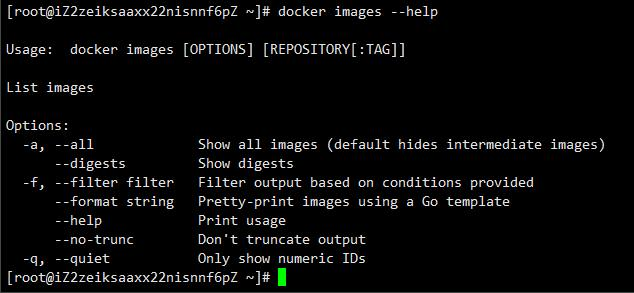

## 安装和启动
安装docker

[官方文档](https://docs.docker.com/engine/install/)

启动docker
```bash
systemctl start docker
```


## 不懂就查帮助，授人以渔

获取命令帮助
```bash
# 获取基本帮助
docker --help
# 获取具体命令rm帮助
docker rm --help
```
### 举例



## 常用的用法举例

### 拉取一个镜像

```bash
docker pull redis
```

### 列出所有镜像
```bash
docker images
```

### 启动一个镜像
`docker run`
| 参数 | 解释 |
|-----|------|
| name | 指定容器的名称 可以使用该字段进行启动 |
| p | 容器的端口映射，格式 宿主机端口：容器端口 |
| v | 内容的映射，格式 宿主机内容：容器内容 |
| d | 容器后台运行 |

详见`docker run --help`

**举例子**
```bash
docker run --name myredis -p 6379:6379 -v /var/lib/redis:/data  -v /etc/redis/redis.conf:/etc/redis/redis.conf -d redis
```

## 总结

上面列出了Docker的基本用法，还有简单的获取有用的帮助的方式，新手应该能够看懂，当你只需要简单使用镜像的时候就可以满足需求了，如果你想要更好的学习Docker或者定制自己的镜像你可以通过下面的推荐阅读学习。

## 推荐阅读

[前言 · Docker —— 从入门到实践](https://yeasy.gitbooks.io/docker_practice/)
