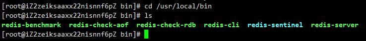
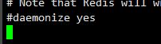
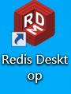
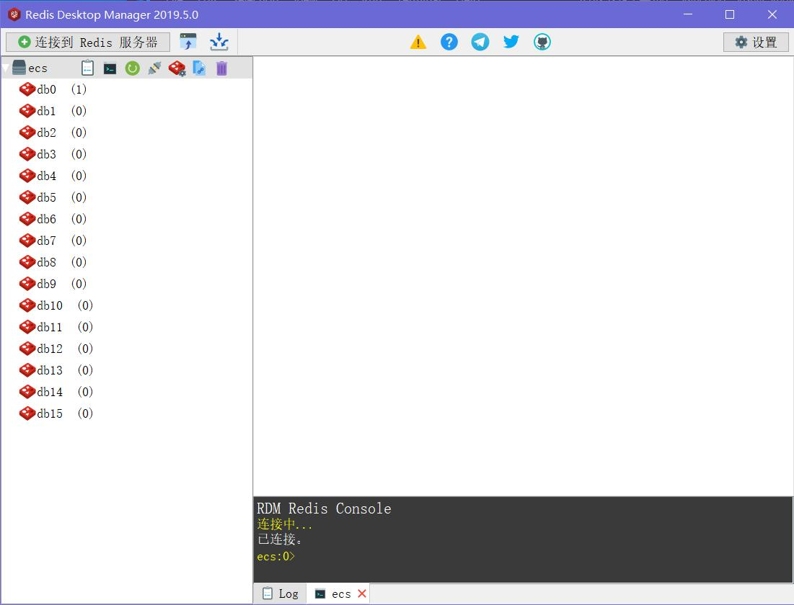

# Redis 快速上手
Redis是一款NOSQL（非关系型）数据库，优点如下：
- 开源
- 键值缓存和存储
  - 内存中
  - 持久化
  - 分布式
  - HA 主从数据库
- 多种数据结构支持
  - String
  - List
  - Hash
  - Set
  - Stored Set
  - Bitmaps
  - Hyperloglogs
- 性能强悍,功能多
- 分布式支持
遵循BSD协议自由使用，可以在BSD的代码上二次开发后商业销售,很受欢迎。

背景，关系型数据库在超大规模和高并发的SNS类型和web2.0力不从心，有很多问题。

NoSQL查询速度快，适用于大数据的环境。

Redis的缺点
- 持久化的问题
  - 定时存储代价大
  - 只保存变化，恢复慢
- 内存消耗大

企业应用场景
- 数据库
- 缓存
- 热点数据（经常查询，但是不经常修改的数据）
- 消息中间件


直接上手安装

## 使用阿里云的ECS直接操作

下载并安装

```bash
# 下载
cd /usr/local/src && wget http://download.redis.io/releases/redis-5.0.7.tar.gz
# 解压
tar xvf redis-5.0.7.tar.gz
# 移动目录
mv redis-5.0.7 /usr/local/redis
# 转移到新目录
cd ../redis
# 编译并且安装
make && make install
```
如果编译报错就

设置编译环境

```bash
# 解决编译错误
sudo yum -y install gcc gcc-c++ libstdc++-devel 
make MALLOC=libc
```

验证安装

```bash
cd /usr/local/bin
ls
```
**截图**



其中`redis-server`是服务端，`redis-cli`是客户端

配置文件复制到/etc/目录下

```bash
mkdir /etc/redis
cp /usr/local/redis/redis.conf /etc/redis/
vi /etc/redis/redis.conf
```
接下来修改配置文件
```bash
vi /etc/redis/redis.conf
```
比较重要的参数

|  字段   | 解释  |
|  ----  | ----  |
| **daemonize**  | 是否用守护进程运行进行，默认值为no |
| pidfile  | 当以守护进程运行时将会把pid写入pid文件 |
| **port** | 端口号 |
| **bind** | 绑定的主机ip,默认 127.0.0.1 | 
| timeout | 客户端闲置多长时间之后关闭连接，为0就是关闭该功能 |
| loglevel | 日志等级 |
| logfile | 日志记录默认为标准输出，守护进程如果为默认则日志就会丢弃 |
| **databases** | 数据库的数量  使用SELECT dbid 连接指定的id |
| **save** | 在一段时间内有一定数量的更新就将数据写入数据文件 save second changes |
| **rdbccompression** | 是否将数据文件压缩 |
| **dbfilename** | 数据文件 |
| **dir** | 数据库位置 |
| slaveof | 设置master服务的ip和端口 |
| masterauth | master设置密码的时候连接密码 |
| **requirepass** | 数据库连接密码 |
| maxclients | 最大客户端连接数 |
| maxmemory | 最大内存数量 |
| appendonly | 日志记录是否在每次更新的时候执行 |
| appendfilename | 更新日志文件名appendonly.aof |
| appenfsync | 日志更新条件 no 表示等待操作系统 always 表示每次写入磁盘 everysec 每秒同步一次 |
| vm-emabled | 是否启用虚拟内存机制 |
| vm-swap-file | 虚拟内存文件路径 |
| vm-max—memory | 将数据（values）大于vm-max-memory存储到虚拟内存当数值为0所有数据都存储在磁盘上 |
| vm-page-size | 虚拟内存分页大小，也就是最小存储单元，根据对象的大小进行设置，小文件最好是32bytes |
| vm-pages | swap文件中page的数量，每8个pages消耗1byte |
| vm-max-threads | swap文件访问线程数 |
| glueoutputbuf | 向客户端应答的时候是否将小包合并为一个发送，默认开启 |
| hash-max-zipmap-entries | 内存优化参数，当某个值的数量超过一个数量就转化为正常的的hash编码，用于内存优化，小于这个设定值就会使用短的编码 |
| hash-max-zipmap-values |  同上 |
| hash-max-ziplist-value | 同上 |
| zset-max-ziplist-entries | 同上|
| zset-max-ziplist-value | 同上|
| set-max-intset-entries | 同上|
| activerehashing | 是否激活重置hash |
| include | 包含其他配置文件 |


修改几个字段就行
```text
# 守护启动
daemonize yes
# 注释掉来允许其他机器来访问Redis服务
# bind 127.0.0.1
# requirepass 设置数据库密码
requirepass password123
```

**注意事项：密码复杂一点，因为Redis每秒可以进行15w次密码尝试**

## Redis启动

二进制文件，参数是配置文件路径

```bash
/usr/local/bin/redis-server /etc/redis/redis.conf
```

## 使用Docker安装
```bash
#安装Docker并启动
yum install docker
systemctl start docker
#拉取redis镜像
docker pull redis
```

修改之前的配置文件
注释掉`daemonize yes`
还有`bind 127.0.0.1`




运行容器
```bash
docker run -d --name myredis -p 6379:6379 -v /var/lib/redis:/data  -v /etc/redis/redis.conf:/etc/redis/redis.conf redis
```
## 获取桌面管理软件


下载地址
（来自网友编译版本）


记得更改名字把`.zip`去掉，这是因为cdn的限制
[jsdelivrCDN](https://cdn.jsdelivr.net/gh/whp98/rdm_free@0.0.2/rdm-201905.exe.zip)


### 可以使用软件直接连接redis服务端，要注意端口的开放

连接上之后软件主界面如图




