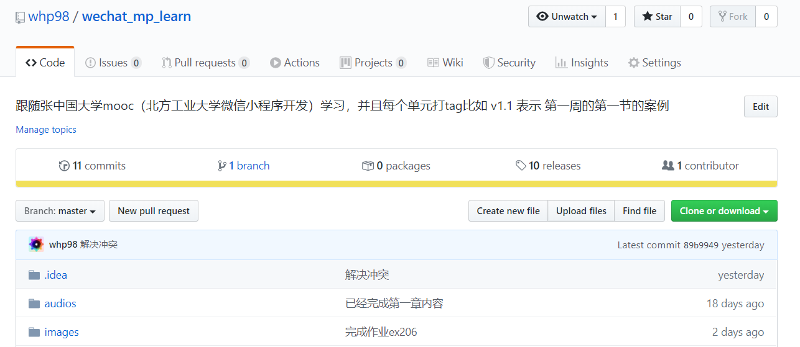
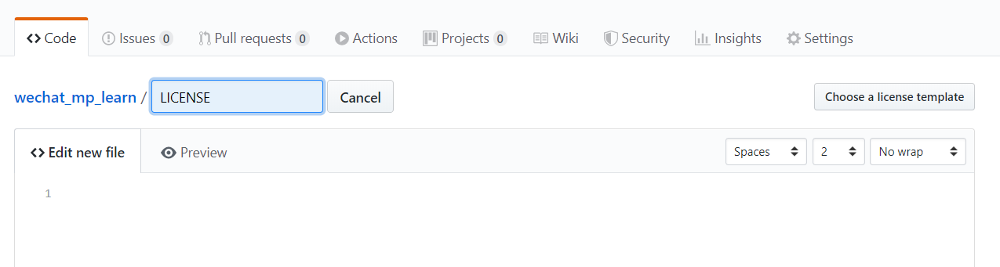
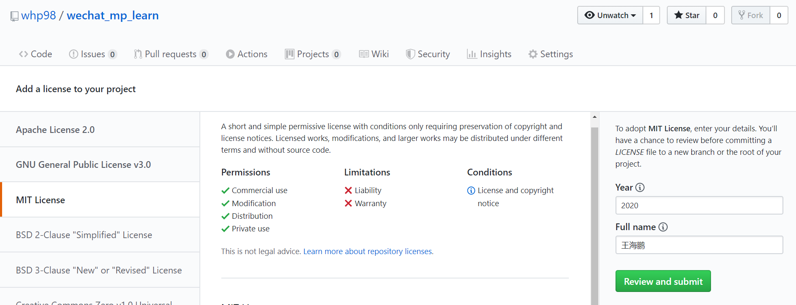
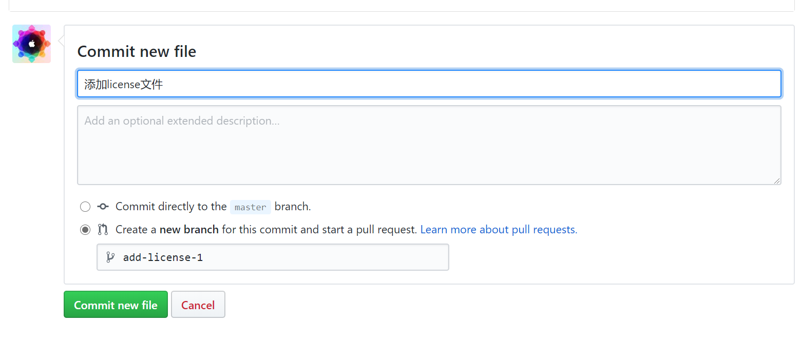
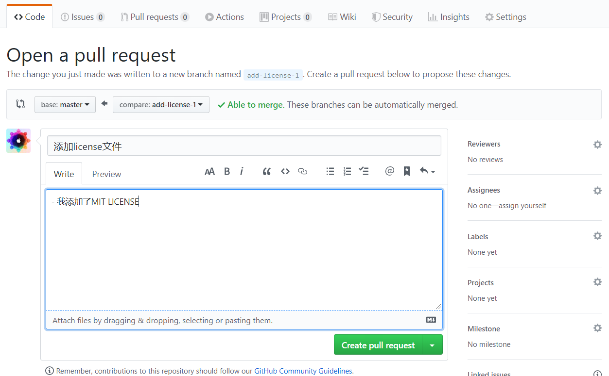
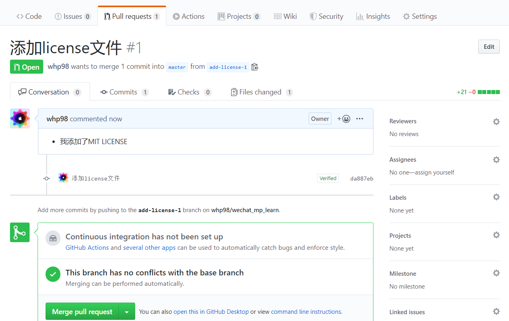
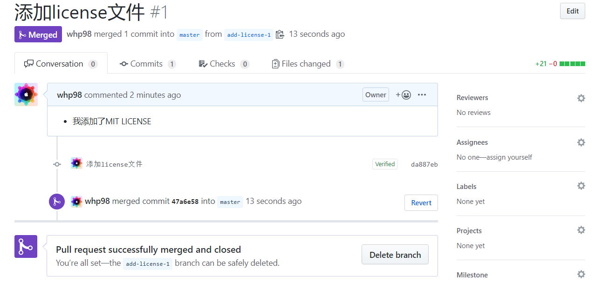
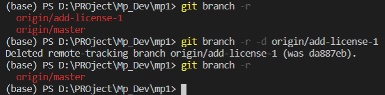

# git创建pull request和删除合并后的远程分支

使用github的时候我们能够发现，官方想要你每次对项目做出修改的时候都创建一个分支，这样能够降低项目的风险。

## 例子：添加LICENSE

当我们修改完成的时候就可以pull request请求和主分支合并，然后仓库的主人就会检查一下修改然后将项目合并到主分支。 然后这时候新建的分支就可以删除了，那么如何删除呢，下面我用为仓库添加一个`LICENSE`为例演示一下如何操作。

首先打开项目首页



点击`Create new file`



填写`LICENSE`然后选择后面的`Choose a license template`填写信息。



添加commit信息




然后进入下一步开启`pull request`



然后操作仓库进行合并`merge pull request`



这时候可以直接 点击 `delete branch`删除分支



## 使用命令删除分支

也使用可以像下面命令操作删除


```ps
# 列出远程分支
git branch -r

```
```ps
# 删除分支
git branch -r -d <branch_name>
```
### 演示




## 总结

git创建分支和合并分支都显得非常简单，所以git使用规范就是每次做修改都创建一个新的分支来操作，然后合并的时候就需要代码的管理员来操作一下，这个操作我们可以自行练习一下，这样我们更加熟练的掌握git技巧，可以更加方便的和其他人一起进行项目开发。