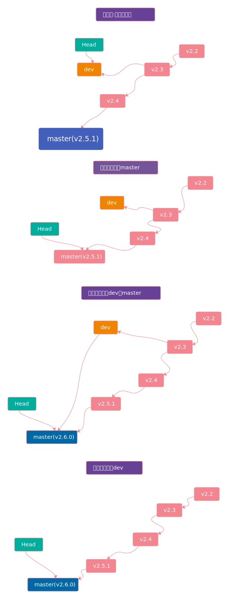
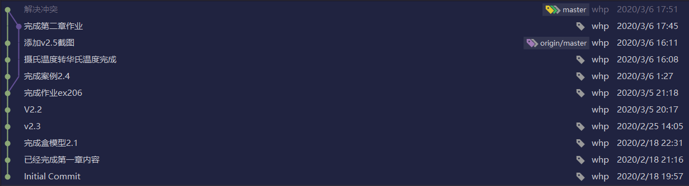

# git原来的历史分支开发出新的分支，合并到最新的分支上面

我最近在学习微信小程序开发，用git做版本管理，今天我遇到了一个问题：

我当前的版本是`v2.5.1`然后有一个作业是综合`v2.2`-`v2.5.1`的内容,我认为这个项目从`v2.3`稍作修改，添加上后面的内容就可以完成作业，所以我们要从当前版本回到`v2.3`版本做修改然后将修改后的内容合并到`master`分支。

## 解决思路

之前我有过一次`head`指针游离的经历所以我决定创建分支来解决此问题。


具体的解决思路如下图：




## 实际操作

我决定从dev分支做修改，于是就先删除了原来的`dev`分支,然后从 tag`v2.3`创建`dev`分支

```ps
# 删除分支
git branch -d dev
# 从2.3创建新分支
git branch dev v2.3
```
然后修改代码之后提交到dev分支

这里忽略我的修改过程，直接贴出包含git的操作

```ps
git add .
git commit -m "修改完成，完成了作业"
# 回到master
git switch master
```

合并仓库
```ps
git merge dev
# 如果没冲突会成功，如果有冲突就直接修改文件解决冲突
# 解决完冲突之后
git add .
git commit -m "解决了冲突"
```

给最新的版本打tag

```ps
git tag v2.6.0
# 将新版提交到github
git push --tags
```


## 最终可视化gitlog图

