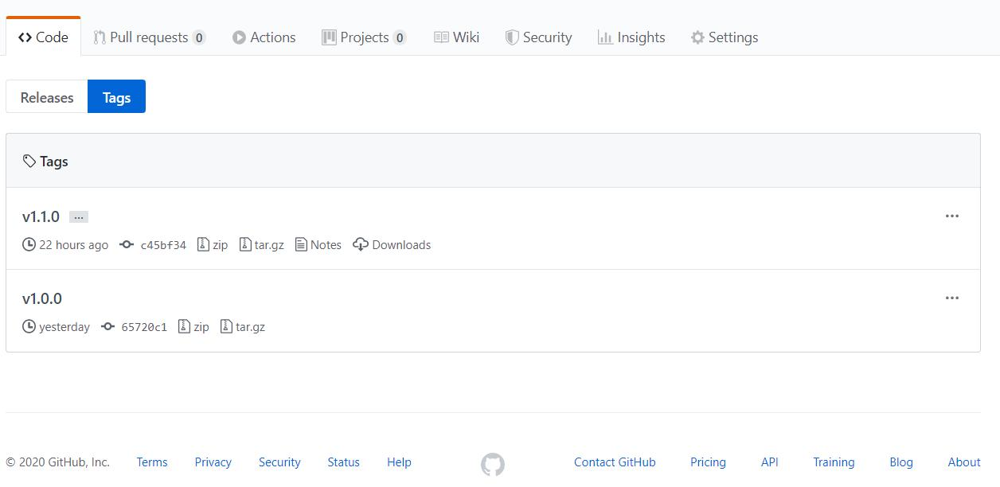
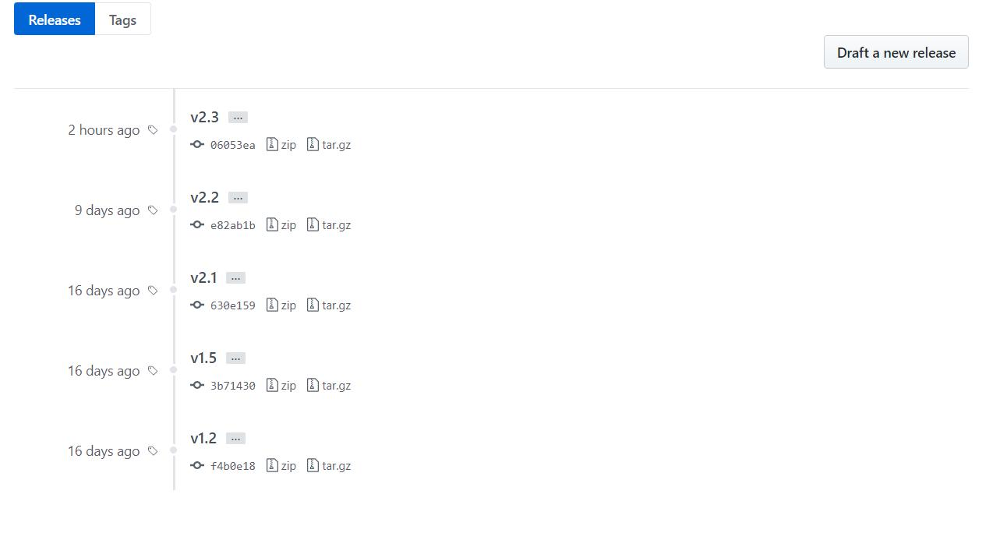
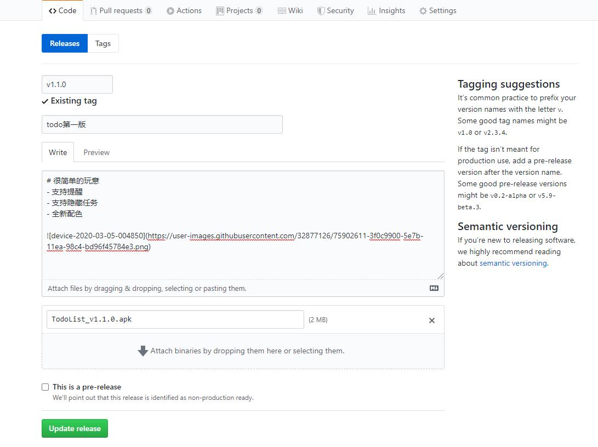

# 如何使用git打标签

学会使用git之后我就用git来管理我的项目，直到有一天我发现别人的项目里面有很多的标签，就像下面的图上所示。



我也就学习了一下,这里分享一下我的学习成果。


这里我只说最简单的内容，如果有问题请查阅文末的官方文档。
## 给最新的commit打标签

```bash
git add .
git commit -m "update ui"
git tag v1.1.1
```
上面的示例就表示你给最新的commit打上了标签，通常你这样做就是为了释放出release

当然你还可以给之前的提交记录打上标签，不过为了简单描述tag我就不赘述了，请查阅官方文档。

## 将tag提交到仓库
默认情况的`push`不会将tag提交到仓库
你需要显示的提交你的tag到仓库

```bash
# push v1.1.1 到远程仓库 origin
git push origin v1.1.1
```

```bash
#推送全部标签到远程仓库
git push origin --tags
```
## 删除一个标签

```bash
# 删除标签
git tag -d v1.1.1
```
## 提交效果

这个tag提交到git仓库之后会自动创建一个release并且将对应的版本源码打包，就像如下图所示：



如果你的项目确实要发布出可执行文件那么你就可以在github网站上修改release添加描述和二进制文件，如下图：



## 建议玩法

当你系统学习某个技术的时候，你可以在每个需要产出可以展示或者可以运行的版本的代码的时候打上一个tag，你就可以将自动打包的阶段性成果直接从GitHub网站上下载下来交差

## 推荐阅读-官方文档

[Git - 打标签](https://git-scm.com/book/zh/v2/Git-%E5%9F%BA%E7%A1%80-%E6%89%93%E6%A0%87%E7%AD%BE)
