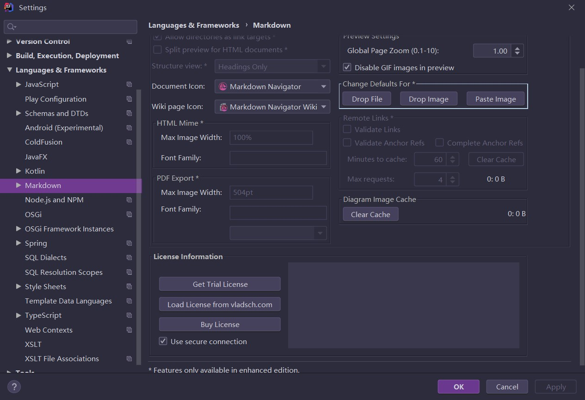
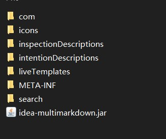
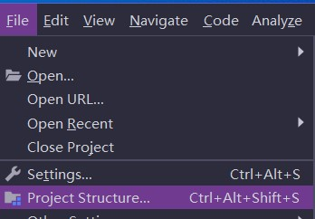
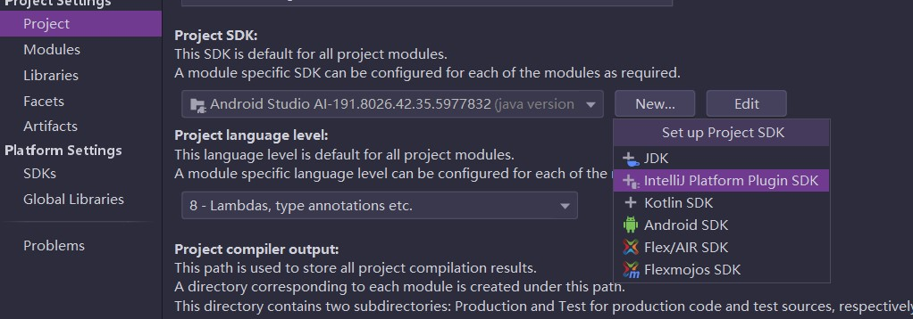
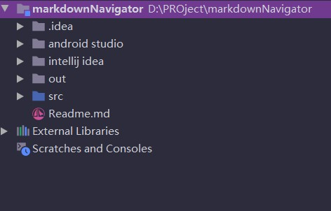
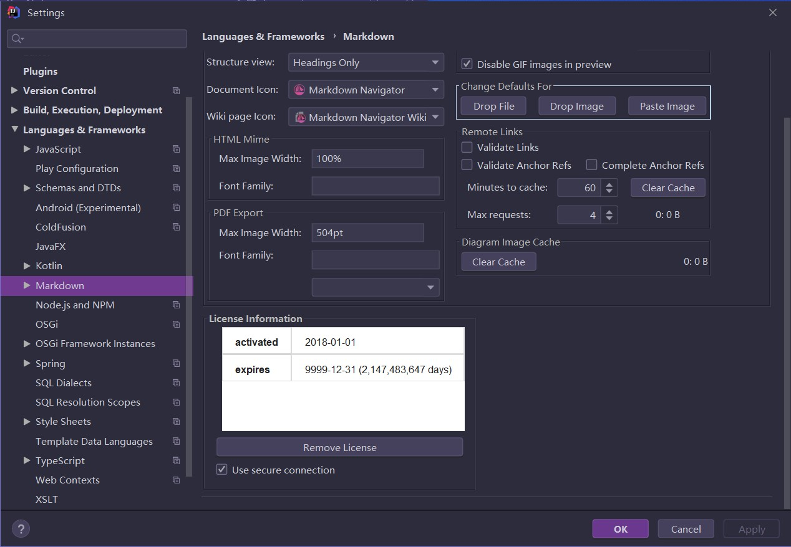

前排提示本项目地址  
[whp98/markdownNavigatorPatch: 破解 markdown Navigator plugin](https://github.com/whp98/markdownNavigatorPatch)

# 破解markdown Navigator插件

支持正版：本方法只适合穷学生等，如果钱足够请买正版

适用平台：windows 10

IDE：jetbrains全系
git
本方法适合所有jetbrains产品以安卓studio为例

请使用安装后的jar包来解压适配

首先在你的idea上安装好插件

然后到

`C:\Users\username\.IntelliJIdea2019.2\config\plugins\idea-multimarkdown\lib
`
提取
`idea-multimarkdown.jar`

新建一个项目文件夹然后在里面新建一个idea文件夹

然后将上面复制的jar包放进去

然后用解压工具解压jar包

`jar xvf idea-multimarkdown.jar`

解压后结构

之后将jar包删除

建立然后右键将 第一个建立的文件夹用idea打开
新建一个src目录然后右键标记为sources root

 

然后在其中建包名
`com.vladsch.idea.multimarkdown.license`

建好之后

 

然后将修改后的文件放到包下，修改后的文件为

[LicenseAgent.java](./LicenseAgent.java)

然后配置sdk

 

选择plugin的选项然后选择要破解的平台安装目录
语言等级和你的jdk一致即可
然后工程下建立编译输出文件夹

 

之后配置依赖库

 

将你的插件依赖目录填上，配置好后如下：

然后将生成的class文件替换掉
markdownNavigator\intellij idea\com\vladsch\idea\multimarkdown\license\LicenseAgent.class
之后就打包
D:\PROject\markdownNavigator\intellij idea>`jar cvf idea-multimarkdown.jar *`
生成的 jar包直接替换掉原来的后重启idea
破解结果如下

# 参考

[破解IDEA插件Markdown Navigator 2.9.7 - 老王的博客](https://wfeil.com/post-79.html)

[Intellij IDEA插件开发入门 - 西代零零发 - CSDN博客](https://blog.csdn.net/dc_726/article/details/14139155)
