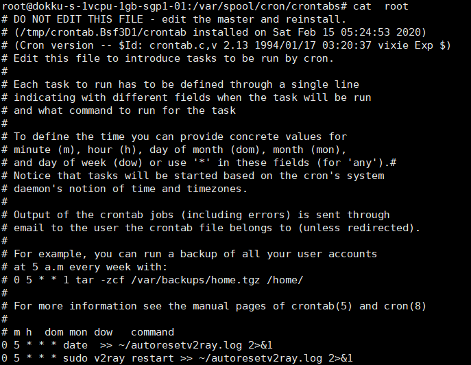
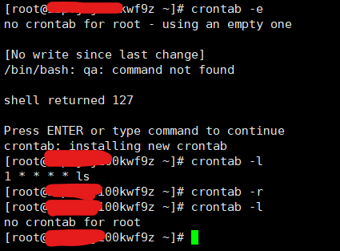

# 如何在Linux主机上定时运行某条命令或者程序以及注意事项

最近我的新加坡主机总是要求google验证，不知道咋回事，我发现定时重启v2ray似乎可以降低验证频率，我决定让我的v2ray每天重启一次，于是我就学习了一下linux上的定时命令。Linux上定时任务类似于Windows的计划任务。corntab命令就是用来设置定时任务的。
# 工作原理
它的工作原理就是这个程序分钟检查配置文件中的任务，如果有需要执行的任务那么它就会在设定的时间执行对应的命令。

# 配置文件

`/var/spool/cron/crontabs`
这个存放用户的配置文件，这个文件夹可能是空的但是我经过编辑之后可以看到root用户的一个文件内容如下


`/etc/cron.d/`
这个中存放着一部分需要执行的脚本，目测都是一些系统级别的定时任务才放

# 简单的使用

本文只是简单介绍一下如何使用所以只说简单实用的方式

编辑当前用户的crontab配置
```bash
crontab -e
```
这个命令会打开当前用户的crontab配置文件（如果没有就会创建一个新的文件）


列出当前用户的计划任务列表
```bash
crontab -l
```
全部删除用户任务
```bash
crontab -r
```


# 编辑定时任务

## 命令基本形式
```bash
* * * * * 要执行的命令
----------------
| | | | |
| | | | ---- 周当中的某天 (0 - 7) (周日为 0 或 7)
| | | ------ 月份 (1 - 12)
| | -------- 一月当中的某天 (1 - 31)
| ---------- 小时 (0 - 23)
------------ 分钟 (0 - 59)
```
## 举例子
### 分钟
每一分钟执行(cmd代表执行的命令，每一行效果相同,下同)
```bash
* * * * * cmd
*/1 * * * * cmd
```
每3分钟执行
```bash
*/3 * * * * cmd
```
### 小时
每小时的第15分钟执行
```bash
15 * * * * cmd
```
13-15点每小时执行
```bash
0 13-15 * * * cmd
```
8点和10点各执行一次
```bash
0 8,10 * * * cmd
```
### 天
每天5点执行
```bash
0 5 * * * cmd
```
每隔一天执行
```bash
0 0 */2 * * cmd
```
每月15号执行
```bash
0 0 15 * * cmd
```

### 周
每周一执行
```bash
1 1 * * 1 cmd
```
每周日执行
```bash
1 1 * * 1 cmd
```
每两周执行
```bash
1 1 * * */2 cmd
```

### 月
每月一号执行
```bash
0 0 1 * * cmd
```
每两个月执行
```bash
0 0 1 */2 * cmd
```

### 年
每年二月执行
```bash
0 0 1 2 * cmd
```
# 注意事项

如果在某个周期内执行一次那么周期内的单位不应该保持‘*’应该指定具体时间否则会导致按照小单位执行

## 比如

你想写每周一执行
```bash
1 1 * * 1 cmd
```
若写成了`* 1 * * 1`则表示每周一的每分钟执行一次

若写成了`0 * * * 1`则表示每周一的每小时执行一次