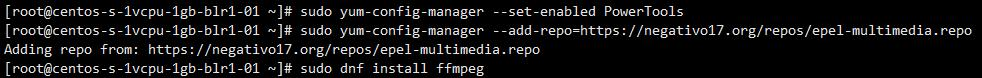
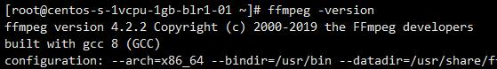

# Centos8安装FFmpeg以及下载m3u8视频方法
Centos8 安装常用软件经常遇到困难 文本介绍如何安装FFmpeg亲测有效

这里由于，编译太麻烦直接下载可以用的版本，需要从negativo17下载
这个需要依赖 EPEL PowerTools 运行下面的命令来开启
```bash
sudo dnf install epel-release dnf-utils
sudo yum-config-manager --set-enabled PowerTools
sudo yum-config-manager --add-repo=https://negativo17.org/repos/epel-multimedia.repo
```


然后就是简单使用dnf安装

```bash
sudo dnf install ffmpeg
```



## 验证安装

```bash
ffmpeg -version
```




## 简单的使用FFmpeg下载m3u8片段转为MP4
```
ffmpeg -i https://tk68m1.cdnlab.live/hls/SnXisJOF9TxvvvzvRKJA7w/1589397517/2000/2970/2970.m3u8 -c copy output.mp4
```