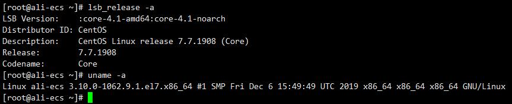
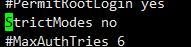

# 阿里云ssh公钥连接不上关闭严格模式
今天阿里云的ECS突然就登陆不上了，尝试了修改目录权限若干次结果发现还是不行。最后关闭sshd的严格模式才解决。

我的系统是Centos 7.7

## 查看主机信息
```bash
# linux 内核
uname -a
# linux 发行版
lsb_release
```



## 更改方式
修改sshd_config的StrictModes 为no
注释掉为默认yes状态

`sudo vi /etc/ssh/sshd_config`




## 小知识,Linux主机名修改

linux修改主机名

在centos 7下可以用
`hostnamectl set-hostname yourhostname`
然后重启终端就可以看到效果了
