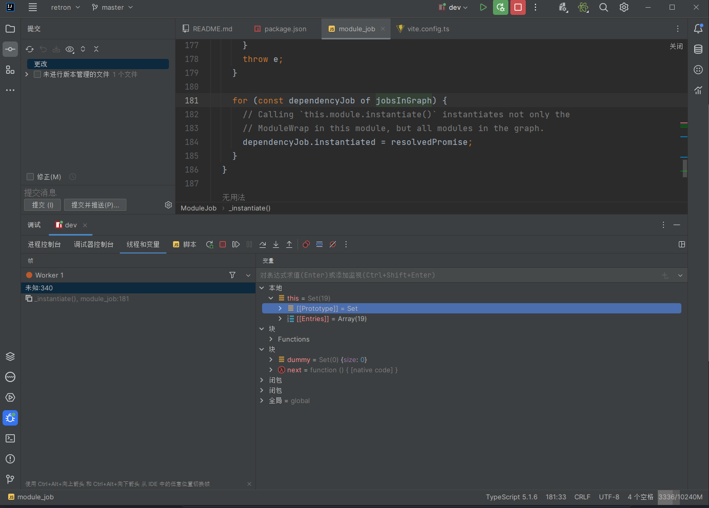

# Electron项目未知断点异常问题解决

## **Describe the bug**
in title

## **To Reproduce**
git clone this project
yarn install
config intellij idea with npm

press the debug run button

and then the code  stopped at an unknown  point

"未知" = `unknown`

only if i press the contiue button the window is render ，every time

## **Expected behavior**
code only stop at break point i added
## **Screenshots**
If applicable, add screenshots to help explain your problem.

**Desktop (please complete the following information):**
- OS: Win10
- Browser Chrome
- node 16
- ide intellij idea

**Additional context**

## Solved by change node version to
`nvm install v18.17.0`
`nvm use 18.17.0`
