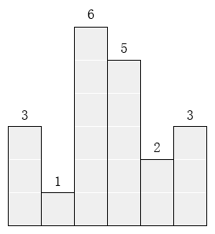

# CCF CSP 201312-3 第三题 最大的矩形

## 问题描述
　　在横轴上放了n个相邻的矩形，每个矩形的宽度是1，而第i（1 ≤ i ≤ n）个矩形的高度是hi。这n个矩形构成了一个直方图。例如，下图中六个矩形的高度就分别是3, 1, 6, 5, 2, 3。



请找出能放在给定直方图里面积最大的矩形，它的边要与坐标轴平行。对于上面给出的例子，最大矩形如下图所示的阴影部分，面积是10。


## 输入格式
　　第一行包含一个整数n，即矩形的数量(1 ≤ n ≤ 1000)。
　　第二行包含n 个整数h1, h2, … , hn，相邻的数之间由空格分隔。(1 ≤ hi ≤ 10000)。hi是第i个矩形的高度。
## 输出格式
　　输出一行，包含一个整数，即给定直方图内的最大矩形的面积。
## 样例输入
```text
6
3 1 6 5 2 3
```
## 样例输出
```text
10
```

## 解题思路

我是用穷举法做的，思路就是确定从第i个到第j个矩形面积的求法：宽度就是两个数相减然后加一，然后高度就是最低的高度，相乘就是结果，然后嵌套两个for循环就可以全部遍历全部情况，找出其中最大的面积就是结果。


## 代码

求面积函数

```java
/*
    找到输入数据中从start到end的最大面积
    算法:
    开始到最后的距离为宽度,
    从开始到最后的最低值为高度,
    相乘就可以得出结果
     */
    public static int getArea(int[] list,int start,int end){
        int hight = list[start];
        int width = end-start+1;
        int temp = list[start];
        for (int i=start+1;i<=end;i++){
            /*
            找到最小值
             */
            temp = list[i];
            if (temp<hight)
                hight=temp;
        }
        return hight*width;
    }
```

主函数

```java
public static void main(String[] args) {
        /*读入数据*/
        Scanner sc = new Scanner(System.in);
        int number = sc.nextInt();
        int[] list = new int[number];
        for (int t=0;t<number;t++){
            list[t]=sc.nextInt();
        }
        /*最大面积*/
        int maxArea = 0;
        for (int i=0; i<number;i++){
            for (int j=i;j<number;j++){
                int area= getArea(list,i,j);
                if (area>maxArea){
                    maxArea=area;
                }
            }
        }
        /*输出结果*/
        System.out.println(maxArea);
}
```
将上面两个函数入主类就可以100分通过

## 总结

这道题暴力法主要是考察计算面积的过程和穷举的思路。其他思路后续有时间再更新。
