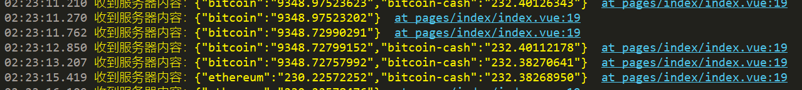
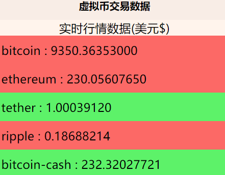

# 使用uni-app开发一款展示股票交易数据的app
最近被各种ddl压得不行，小程序课程的作业不得不做，虽然是学的微信小程序但是我个人比较讨厌大公司这种流量入口垄断的行为，
而且被vue的组件化开发所吸引，于是决定放弃原生开发，转投面向全平台的uni-app。

由于项目完成时间有限，所以我决定开发一个比较简单的项目，这个项目使用一个免费的数据接口，用于展示K线图和盘口数据，还有可视化这些数据，我知道这个不会有太出彩的地方，但是也没办法了。

## 项目使用uCharts做可视化

我看到Dcloud官方库里面比较出彩的就决定使用这个做了，接下来就是一个一个的实现功能了


## 价格展示的实现

首页展示各种虚拟货币的交易价格，形成一个列表先来一个最简单的纯文字展示数据，使用websocket接口订阅数据，一开始我是用这个

`wss://ws.coincap.io/prices?assets=ALL`这个接口订阅所有数字货币的实时价格，后来我觉得不太行，因为变化太快类型太多所以减少一些选了最火的10个币：bitcoin、ethereum、tether、ripple、bitcoin-cash、bitcoin-sv、litecoin、binancecoin、eos、cardano。
订阅变成：`wss://ws.coincap.io/prices?assets=bitcoin,ethereum,tether,ripple,bitcoin-cash,bitcoin-sv,litecoin,binance-coin,eos,cardano`。
下一步就是建立ws连接获取数据：
```js
uni.connectSocket({url:"wss://ws.coincap.io/prices?assets=bitcoin,ethereum,tether,ripple,bitcoin-cash,bitcoin-sv,litecoin,binance-coin,eos,cardano"})
uni.onSocketMessage(function (res) {
			  console.log('收到服务器内容：' + res.data);
});
```
效果如下：


接下来呢就是数据绑定直接展示数字货币的价格为了骚气我让它显示一些颜色：



具体代码如下

```
<view v-for="(value, key, index) in prices" :key="key" v-bind:class="value.isup ? 'isup' : 'isdown'">
	<view class="price_box">
			   {{ key }} : {{ value.p }}
	</view>
</view>

样式

.isup{
	width: 100%;
	background: #ff6e6e;
}
.isdown{
	width: 100%;
	background: #59fd72;
}
	
.price_box{
	margin: 10px;
}
```
代码具体请看[完成文字展示](https://github.com/whp98/uni-cryptocurrency/tree/ffd7b1e23b2c358fbaa9499380be030afbb65689)


## 开始画图相关的工作，使用画图组件

完成了上一步，下一步就是绘制k线图

k线图使用的uCharts的Candle组件，这个使用官方示例的代码来组织数据，具体的使用直接从官方的demo中copy出代码，再getserverdata中修改获取数据的部分就可以了

具体的大体修改部分如下：

