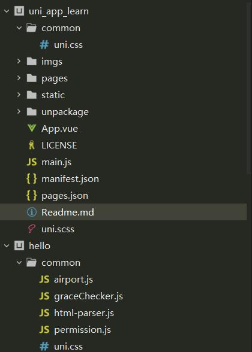
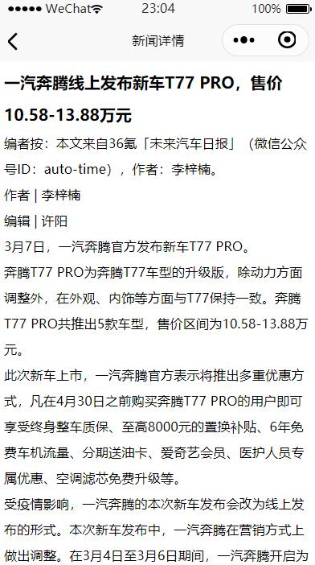

# uni-app 官方入门教程Demo开发 带源码


学习了一下uni-app的官方示例，为了入门学习特此记录一下。

首先创建项目之后我们按照官方视频进行开发。


## 练习的API
使用到拿来练习的API：

### 列表

https://unidemo.dcloud.net.cn/api/news

- 返回数据格式
  - id 新闻id 例如：72980
  - title 新闻标题
  - create_at 创建时间
  - author_avatar 图标

### 详情

https://unidemo.dcloud.net.cn/api/news/36kr/+id

使用富文本组件来展示新闻内容

```xml
<rich-text class="richText" :nodes="strings"></rich-text>
```

## 具体实战内容

首先新建空白项目
新建目录`common`
然后新建`hello-uni-app`项目

然后将`hello-uni-app`中的 `/common/uni.css` 复制到新项目中（HbuliderX可以打开N个项目），如下图：



之后修改空白项目中的`App.vue`文件如下：
目的是引入js

```xml
<script>
	export default {
		onLaunch: function() {
			console.log('App Launch')
		},
		onShow: function() {
			console.log('App Show')
		},
		onHide: function() {
			console.log('App Hide')
		}
	}
</script>

<style>
	/*每个页面公共css */
	@import url("./common/uni.css");
</style>

```

之后处理页面的显示内容，修改 `/pages/index/index.vue`内容如下：

```xml
<template>
	<view class="content">
		<view class="uni-list">
			<view class="uni-list-cell" hover-class="uni-list-cell-hover" v-for="(item,index) in news" :key="index" 
			@tap="openDetail" :data-newsId="(item.post_id)">
				<view class="uni-media-list">
					<image class="uni-media-list-logo" :src="item.author_avatar"></image>
					<view class="uni-media-list-body">
						<view class="uni-media-list-text-top">{{item.title}}</view>
						<view class="uni-media-list-text-bottom uni-ellipsis">{{item.create_at}}</view>
					</view>
				</view>
			</view>
		</view>
	</view>
</template>

<script>
	export default {
		data() {
			return {
				news : []
			}
		},
		onLoad:function() {
			uni.showLoading({
				title:"加载中 ..."
			})
			uni.request({
				url: 'https://unidemo.dcloud.net.cn/api/news',
				method: 'GET',
				data: {},
				success: res => {
					console.log(res);
					this.news = res.data;
					uni.hideLoading();
				},
				fail: () => {},
				complete: () => {}
			});
		},
		methods: {
			openDetail(e){
				console.log(e);
				var newsId = e.currentTarget.dataset.newsid;
				uni.navigateTo({
					url: '../news_detali/news_detali?newsId='+newsId
				});
			}
		}
	}
</script>

<style>
	.content {
		display: flex;
		flex-direction: column;
		align-items: center;
		justify-content: center;
	}

	.logo {
		height: 200rpx;
		width: 200rpx;
		margin-top: 200rpx;
		margin-left: auto;
		margin-right: auto;
		margin-bottom: 50rpx;
	}

	.text-area {
		display: flex;
		justify-content: center;
	}

	.title {
		font-size: 36rpx;
		color: #8f8f94;
	}
	.uni-media-list-body{
		height: auto;
	}
	.uni-media-list-text-top{
		line-height: 1.6em;
	}
</style>

```
在pages目录中新建页面`news_detail`
然后修改 `/pages/news_detail/news_detail.vue`内容如下:
```xml
<template>
	<view class="content">
		<view class="title">{{title}}</view>
		<view class="article-content">
			<rich-text class="richText" :nodes="strings"></rich-text>
		</view>
	</view>
</template>

<script>
	export default {
		data() {
			return {
				title: '',
				strings: ''
			}
		},
		onLoad(e){
			console.log(e);
			uni.request({
				url: 'https://unidemo.dcloud.net.cn/api/news/36kr/'+e.newsId,
				method: 'GET',
				data: {},
				success: res => {
					console.log(res);
					this.title=res.data.title;
					this.strings=res.data.content;
				},
				fail: () => {},
				complete: () => {}
			});
		}
	}
</script>
<style>
	.content{
		padding: 10upx 2%; width: 96%; flex-wrap:wrap;
	}
	.title{
		line-height: 2em;
		font-weight: 700;
		font-size: 38upx;
	}
	.article-content{
		line-height: 2em;
		font-size: 32upx;
	}
</style>

```
然后就可以运行了

为了调试方便还可以给app启动的时候添加条件在`pages.json`中配置如下：

```json
{
	"pages": [ //pages数组中第一项表示应用启动页，参考：https://uniapp.dcloud.io/collocation/pages
		{
			"path": "pages/index/index",
			"style": {
				"navigationBarTitleText": "News首页"
			}
		}
	    ,{
            "path" : "pages/news_detali/news_detali",
            "style" : {
				"navigationBarTitleText": "新闻详情"
			}
        }
    ],
	"globalStyle": {
		"navigationBarTextStyle": "black",
		"navigationBarTitleText": "News",
		"navigationBarBackgroundColor": "#F8F8F8",
		"backgroundColor": "#F8F8F8"
	},
	"condition": { //模式配置，仅开发期间生效
	    "current": 0, //当前激活的模式（list 的索引项）
	    "list": [{
	            "name": "主界面", //模式名称
	            "path": "pages/index/index", //启动页面，必选
	            "query": ""//启动参数，在页面的onLoad函数里面得到。
	        },{
	            "name": "详情页面", //模式名称
	            "path": "pages/news_detali/news_detali", //启动页面，必选
	            "query": "newsId=5158607" //启动参数，在页面的onLoad函数里面得到。
	        }
	    ]
	}
}

```

## 运行效果展示

博客懒加载的好处哈哈，选择太长不看的人看不到演示图，哈哈哈😁😂





## 伸手党的福利

源代码请从github直接下载

代码比较适合新手跑一跑，也可以拿来参考，纯手打：

[Release v0.1.1 · whp98/uni_app_learn](https://github.com/whp98/uni_app_learn/releases/tag/v0.1.1)

## 总结

本次学习到

uni-app的数据绑定 使用 `:name=value` 的形式绑定

uni-app的方法绑定 使用 `@事件名=”方法名“`的方式绑定

页面之间的参数传递可以使用 `url?key=value`的方式

方便开发可以在pages.json中配置条件来进行开发时的页面跳转
### 重点
uni-app可以极大的简化多平台部署的小程序开发的流程，减少了学习成本，并且可以同时学习主流框架`vue`的用法,性价比极高，必须点一个大赞.


## 官方链接

[uni-app官网](https://uniapp.dcloud.io/)

[uni-app跨平台框架官方教程-学习视频教程-培训课程-腾讯课堂
](https://ke.qq.com/course/343370?taid=2788142445051210)