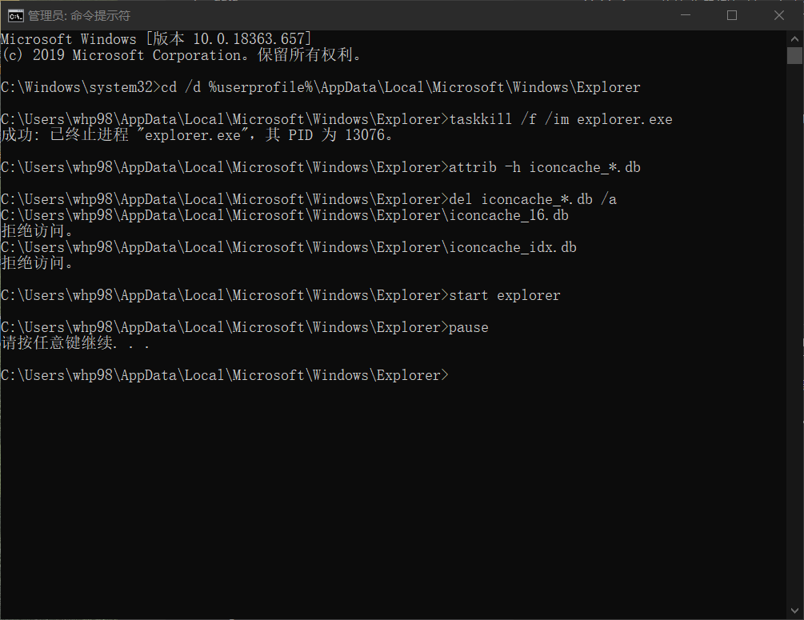

# 前情提要

今天笔记本硬盘掉线了，电脑蓝屏。当下吓得要死，好在只是硬盘线松开了加固了之后又满血复活了，但是开始菜单的图标都消失了变成了下面的样子：


当时没有截图大概每一个都像上面这个一样，变成了默认的程序图标，我先后找了几个解决方案实验最终解决了.分享出来让大家参考一下。

# 尝试一：通过删除图标数据库来让win10重建图标缓存
虽然这个并没有解决开始菜单的图标异常问题，但是我还是试了一下，似乎没有用，网上大都是用来解决win10 桌面的图标异常的，有这个问题的朋友可以尝试一下，方法如下：
管理员打开CMD：


输入以下内容
```cmd
cd /d %userprofile%\AppData\Local\Microsoft\Windows\Explorer
taskkill /f /im explorer.exe
attrib -h iconcache_*.db
del iconcache_*.db /a
start explorer
pause
```


这个是立即奏效的如果不奏效看看第二个

# 尝试二：运行命令来重新注册Windows商店应用

`Win + X + A` 打开powershell管理员

输入下面的命令

```powershell
$manifest = (Get-AppxPackage Microsoft.WindowsStore).InstallLocation + '\AppxManifest.xml' ; Add-AppxPackage -DisableDevelopmentMode -Register $manifest
```

然后重启电脑

我就是通过这个方式解决了图标失效的问题

# 尝试三：扫描win10系统文件并且在线修复

`Win + X + A` 打开powershell管理员

输入下面的命令

```powershell
DISM.exe /Online /Cleanup-image Scanhealth
DISM.exe /online /cleanup-image /restorehealth 
sfc /scannow
```
