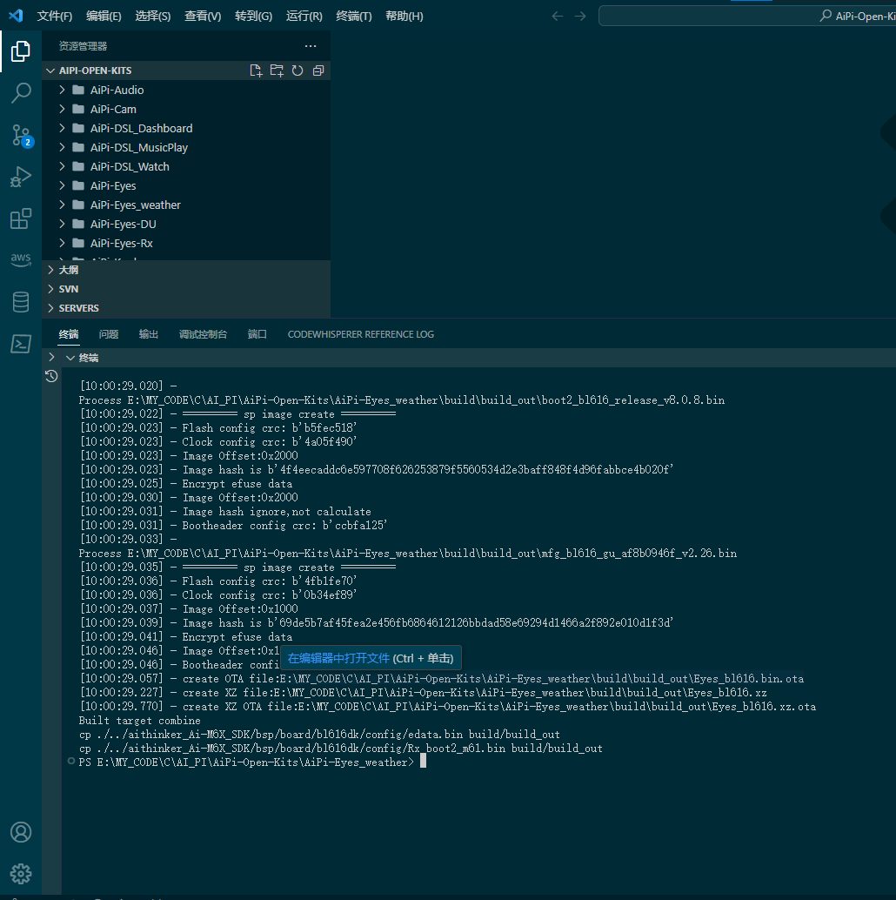

# Ai-M61-32S开发板编译
[本文参考](http://bbs.ai-thinker.com/forum.php?mod=viewthread&tid=282&extra=page%3D2&_dsign=7fea3002)


## 1-拉代码


```shell
git clone https://gitee.com/Ai-Thinker-Open/AiPi-Open-Kits.git
```


## 2-改submodel成gitee


## 3-初始化各个子模块和编译工具

```shell
cd AiPi-Open-Kits/
git submodule init
git submodule update
cd aithinker_Ai-M6X_SDK/
git submodule init
git submodule update
git clone https://gitee.com/bouffalolab/toolchain_gcc_t-head_windows.git
```
## 4-配置环境变量

```txt
aithinker_Ai-M6X_SDK\toolchain_gcc_t-head_windows\bin
aithinker_Ai-M6X_SDK\tools\make
aithinker_Ai-M6X_SDK\tools\ninja

```


## 5-检查环境变量是否配置成功
```shell
make -v

```


## 6-检查环境变量是否配置成功
```shell
 riscv64-unknown-elf-gcc -v

```


## 7-编译天气代码成功
```shell
cd AiPi-Open-Kits\AiPi-Eyes_weather
make
```
