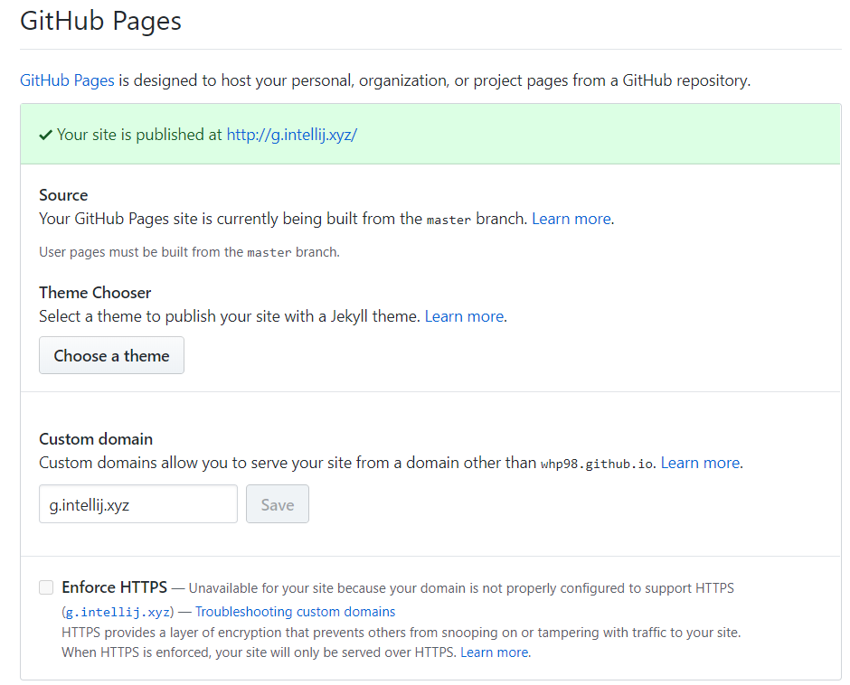
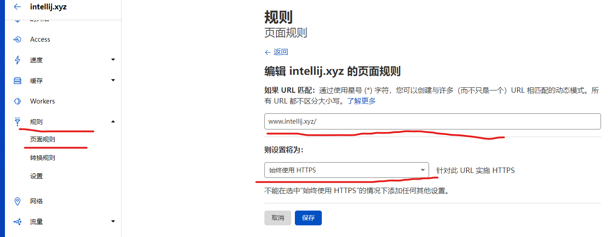

# 使用cloudflare开启githubpages的强制https访问

## 前言

如果你和我一样使用github Pages搭建了自己的博客但是遇到了无法开启强制https的情况可以使用我这里的方法来试试。

我就是这样我设置了开启但是，这个小勾一直勾选不上，气得很。

经过一番探索我用cloudflare的页面规则解决了这个问题。

## 前置要求

- 使用cloudflare作为你的dns服务商
- 还有至少一条页面规则可以用（免费的账户最多支持三条页面规则）
- 开启了cloudflare的cdn云朵

## 开始操作

打开cloudflare页面，添加一个页面规则，设置成下图所示即可

## 测试成果

设置好之后你输入 http://你的网站直接就会跳转到 https://的页面

到这，全部就完成了，可以试试。