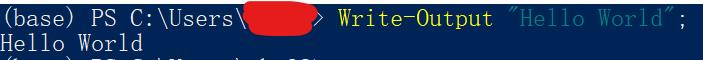
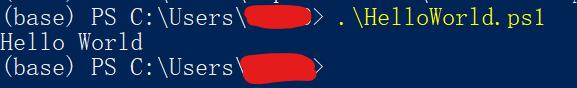

# Hexo一键部署并备份Powershell脚本

最近玩Hexo每次写完博客都要一顿操作猛如虎来发表文章，一般人都会比较厌烦这些比较麻烦的步骤，
本篇博客就是介绍如何书写一键部署脚本

## 为啥用Powershell

Powershell是巨硬推出的新一代shell优点就是面向对象，并且可以跨平台使用，这是cmd和bash是无法匹敌的好玩意，并且可以调用cmd .dll类库（强大的.Net core支持）是真正意义上的乱炖大杂烩，学会之后可以为Linux和Mac os安装使用。我用起来还是比较方便哈，虽然本文这个脚本是很简单的脚本。

## 在屏幕上打印文本

`Win + x + i`打开Powershell输入
```powershell HelloWorld.ps1
Write-Output "Hello World";
```
你会看到



你可以将这一行命令保存在`HelloWorld.ps1`中直接在shell中打开该文件就可以运行了。
（由于powershell中文默认编码为gb2312所以如果有中文请保存为gbk或是gb2312编码）


Powershell脚本会按照行一行一行的执行每行的命令

## 脚本实战

那么现在你现在学的已经可以写一些简单的脚本了，就比如

```powershell hexo_cl_g_s.ps1
Write-Output "---------清空开始---------";
hexo cl;
Write-Output "----------清空结束---------";
Write-Output "---------生成开始-----------";
hexo g;
Write-Output "----------生成结束----------";
Write-Output "--------启动本地服务器------";
hexo s;
```
配合vscode使用体验贼好，

## 本人的代码示例

```powershell push.ps1
Write-Output "--------------0/5开始清理数据库---------------------";
hexo cl;
Write-Output "-------------1/5清理完毕，开始生成页面---------------";
hexo g;
Write-Output "-------------2/5生成完毕，开始代码压缩---------------";
gulp;
Write-Output "------------3/5压缩完毕，开始部署--------------------";
hexo d;
Write-Output "-------------4/5部署完毕，开始备份-------------------";
git add .;
git commit -m "backup";
git push;
Write-Output "-------------5/5备份完毕，全部任务完成---------------";

```

## 总结

Powershell是很强的shell工具感兴趣的可以查看微软的官方文档，作为win10用户用powershell作为自己的自动化工具真的很省心，而且微软也在努力的将powershell推向linux和mac os具有很好的跨平台性，是我们值得学习的好工具。

## 推荐阅读

[PowerShell 文档 - PowerShell | Microsoft Docs](
https://docs.microsoft.com/zh-cn/powershell/)