使用阿里云OSS部署静态博客并且开启CDN加速和HTTPS访问
===================================================

以前为了写博客买了一个阿里云学生机，在上面部署了一个Jpress博客。之后发现这个博客占用了较大资源，由于使用数据库啥的对于将来文章转移啥的也不是很方便，还有这台机器做科学上网的中转机器导致网站访问速度缓慢，于是决定使用静态博客，免费的静态博客也是有的经过我的测试发现一个问题是博客访问速度缓慢。

 

我偶然发现静态博客可以放到阿里云的OSS上并且可以开启CDN加速，考虑到我的域名和备案啥的都是阿里云搞得，体验也不错于是我也就想搞一下子，同时为了分享一下经验就写下这篇博客分享过程。

 

当前网站运行在阿里云OSS上并且使用阿里CDN进行国内加速，本篇博客内容主要是部署到OSS上的过程和开启CDN加速和HTTPS访问的过程。

 

完成这一切主要包含以下几个步骤（个人建议按照顺序进行）：

-   修改博客的主题和设置让其满足OSS部署的条件

-   到阿里云开启OSS存储桶

-   为博客安装阿里云部署插件部署网站（排查问题并且返回第一步进行配置）

-   开启CDN和HTTPS访问

 

修改博客的主题和设置让其满足OSS部署的条件
=========================================

 OSS全称是Object Storage Service
即对象存储服务，它可以存储文档，图片，和各种各样的文件，部署过Hexo博客的人大概知道Hexo就是将写好的文档用程序转化为html的网页，这里就会有一个问题存在，就是我们平时访问的网页或者Hexo生成的网页通常是
*https://hexo.io/news/2019/12/22/hexo-4.2_hexo-util-1-8_eslint-config-hexo-released/*
而实际上我们需要访问
[https://hexo.io/news/2019/12/22/hexo-4.2_hexo-util-1-8_eslint-config-hexo-released/index.html
](https://hexo.io/news/2019/12/22/hexo-4.2_hexo-util-1-8_eslint-config-hexo-released/index.html)

也就是，需要指向一个特定的HTML文件。

但是由于OSS只是一个无情的文件存储机器，他不会自己判断（还有后面的CDN也是一样的）所以我们需要在我们的博客生成规则上做些改动让他满足OSS部署的条件。

 
-

修改文章的永久链接
------------------

首先我们需要在我们的`Hexo/_config.yml` 修改permalink为 `posts/:abbrlink/index.html`

这里我用了abbrlink原来的是`posts/:abbrlink/` 也就是加`index.html` 后缀

 

修改主页菜单的链接地址
----------------------

 

我这里使用的是hexo-theme-matery（<https://blinkfox.github.io/tags/hexo-theme-matery/>）主题，具体的配置请看看作者的文章

 

`themes\matery\_config.yml` 中菜单中

改为以下内容

 
```yml
menu:

Index:

url: /

icon: fas fa-home

Tags:

url: /tags/index.html

icon: fas fa-tags

Categories:

url: /categories/index.html

icon: fas fa-bookmark

Archives:

url: /archives/index.html

icon: fas fa-archive

About:

url: /about/index.html

icon: fas fa-user-circle
```
特点是在分页菜单后面加上`index.html`

 

修改插件的配置
--------------

我看到一些博主使用的是图床进行图片配置我嫌麻烦我还是使用`hexo-asset-image`这个插件在文章中方添加图片遵守着文章在图片就在的道理，这里就比较有意思了因为我发现我的图片原本可以直接访问
`posts/abcd/hello.png` 但是需要现在需要访问 `posts/abcd/index/hello.png`

方法就是

`node_modules\hexo-asset-image\index.js`

20行改成
```js
    link = link.substring(beginPos, endPos)+'/index';
```
然后清除之后重新生成就好了

 

这里可以搞一个骚的：在阿里云中开启图片的style修改这里的链接可以在文章中的图片上加上水印。

 
-

分页插件修改
------------

 
-

`node_modules\hexo\lib\plugins\helper\paginator.js`

行8改成
```js
return i =\> ctx.url_for(i === 1 ? base : base + format.replace('%d', i))+"index.html";
```
 

标签云插件修改（似乎对本主题不管用）
------------------------------------

node_modules\hexo\lib\plugins\helper\tagcloud.js

66行改成
```js
  `<a href="${this.url_for(tag.path)}+'index.html'" style="${style}">${transform ? transform(tag.name) : tag.name}</a>`
```
 

 
-

修改主题的细节内容
------------------

 

这里我先提供以下基本的修改思路，我发现页面中的东西都是根据主题中的layout生成的，要是有一点代码的基础就可以看懂，通过修改layout中的页面生成规则就可让文中的链接加上index.html后缀，如果你的主题是跟我一样的话可以参考以下修改内容：

修改标签云

`themes\matery\layout\_widget\tag-cloud.ejs`

行34改成

```html
<a href="<%- url_for(tag.path) %>index.html" title="<%- tag.name %>: <%- tag.length %>">
```

修改标签词云

`themes\matery\layout\_widget\tag-wordcloud.ejs`

行20改成

```html 
tagWordArr.push({'text': tag.name, 'weight': tag.length, 'link': decodeURI(tag.permalink+"index.html")});
```

修改分类云

`themes\matery\layout\_widget\category-cloud.ejs`

行35 改成

```html
<a href="<%- url_for(category.path) %>index.html" title="<%- category.name %>: <%- category.length %>">
```

 

文章内容的标签分类链接修改

`themes\matery\layout\_partial\post-detail.ejs`

10行改为

```html 
<a href="<%- url_for(tag.path) %>index.html">
```

26行改为

```html
<a href="<%- url_for(category.path) %>index.html" class="post-category">
```
主页的文章标签链接

`themes\matery\layout\index.ejs`

116行改成

```html
<a href="<%- url_for(tag.path) %>index.html">
```

98行改成

```html
<a href="<%- url_for(category.path) %>index.html" class="post-category">
```

` themes\matery\layout\archive.ejs`
46行
```html
<a href="<%- url_for('/archives/' + year) %>/index.html"><%- year %></a>

```
57行
```html
<a href="<%- url_for('/archives/' + year + '/' + m) %>/index.html"><%- m %></a>

``` 
99行
```html
<a href="<%- url_for(category.path) %>index.html" class="post-category">
``` 
117行
```html
<a href="<%- url_for(tag.path) %>index.html"><span class="chip bg-color"><%= tag.name %></span></a>
``` 
`themes\matery\layout\_partial\post-statis.ejs`
10行
```html
<span class="count"><a href="<%- url_for('/categories') %>/index.html"><%- site.categories.length %></a></span>
``` 
17行
```html
<span class="count"><a href="<%- url_for('/tags') %>/index.html"><%- site.tags.length %></a></span>
``` 
`themes\matery\layout\_widget\my-skills.ejs`

```html
<a href="<%- url_for(tag.path) %>index.html">
```

测试成果的方式
--------------

 

打开主页测试菜单的链接是否可用，注意测试每个菜单项
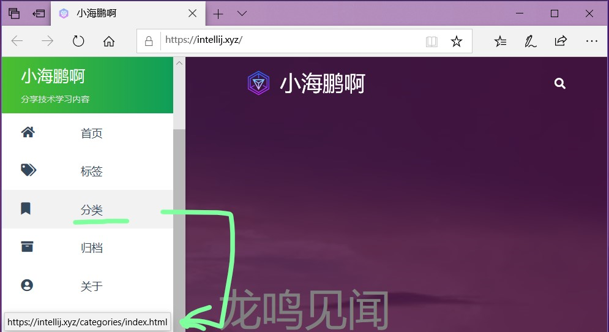

首页文章标签

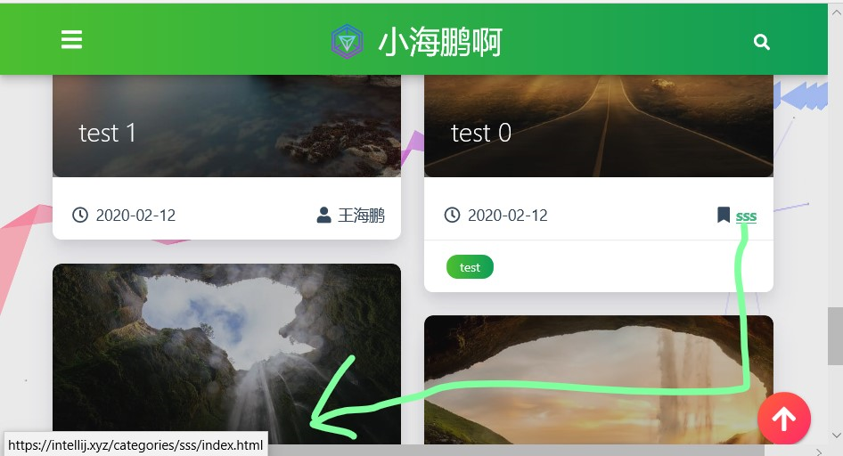

文章内标签

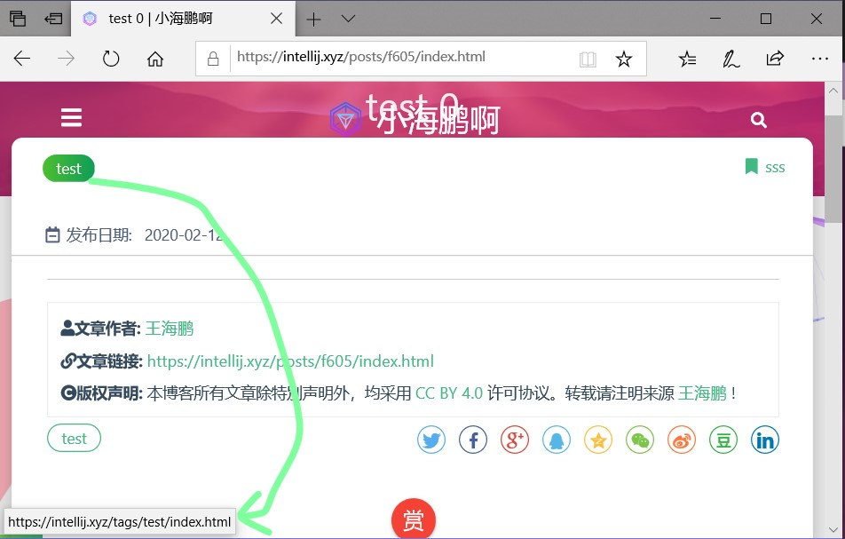

以上只是举例子，麻烦小伙伴按照自己的实际主题进行修改

 

以上内容本地操作即可 即 `hexo s`
启动服务器本地查看，注意，没有index.html的页面都会在oss上访问主页。

 

到阿里云开启OSS存储桶
=====================

点击创建存储桶

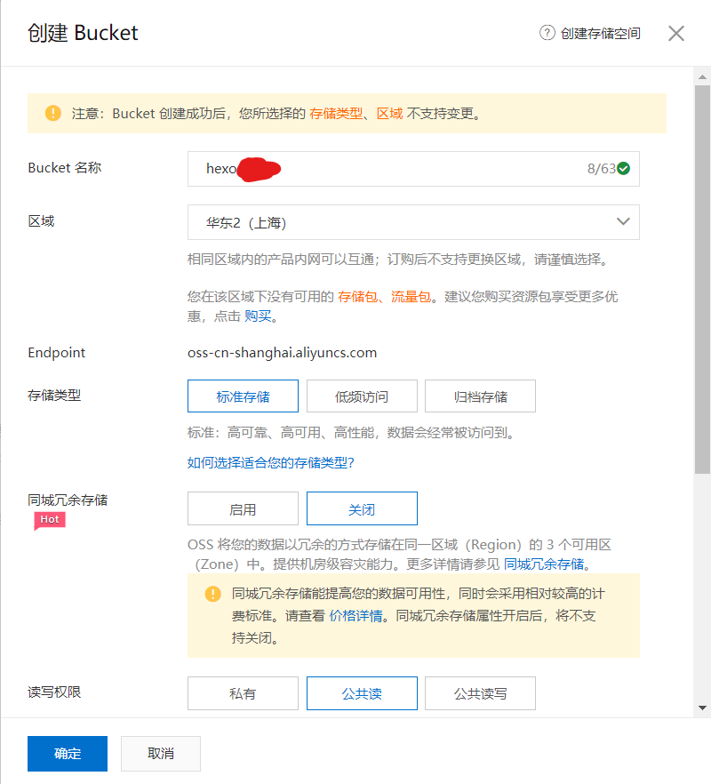

 
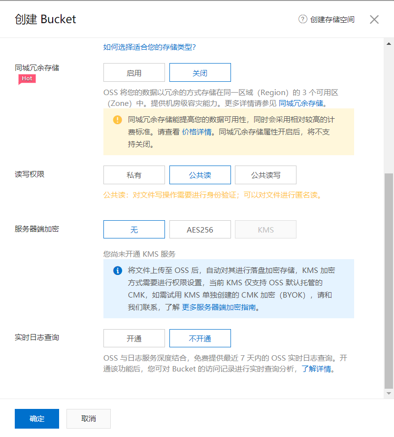
 

注意这里的权限是公共读，也就是任何人都能读取你的存储桶内容

当存储桶创建好之后就可以通过

`存储桶名.oss-cn-地区.aliyuncs.com/文件名` 访问存储桶内容

然后你可以通过web管理页面上传文件

上传之后就可以访问了
比如

<https://hexo-web.oss-cn-shanghai.aliyuncs.com/favicon-64.png>

但是直接访问会导致直接跳转到下载

你需要绑定一个域名，并且该域名用CNAME指向存储桶所用的网址

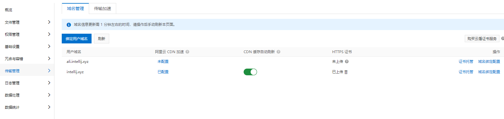

 
然后你访问

<http://ali.intellij.xyz/favicon-128.png>

就会发现显示了图片而不是下载

同理访问你的静态网站就是访问你的index.html文件

然后是创建阿里云的ram账户，这里的用处就是用程序访问你的存储桶的时候做到权限管理，防止因为一个AccessKey泄露导致你的全部账户内容被攻击

我创建了一个ram账户

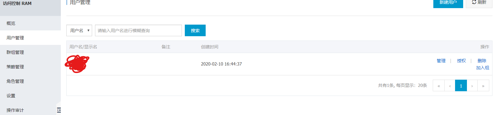

创建AccessKey

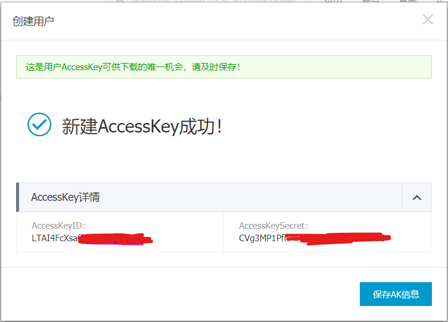

为账户授权

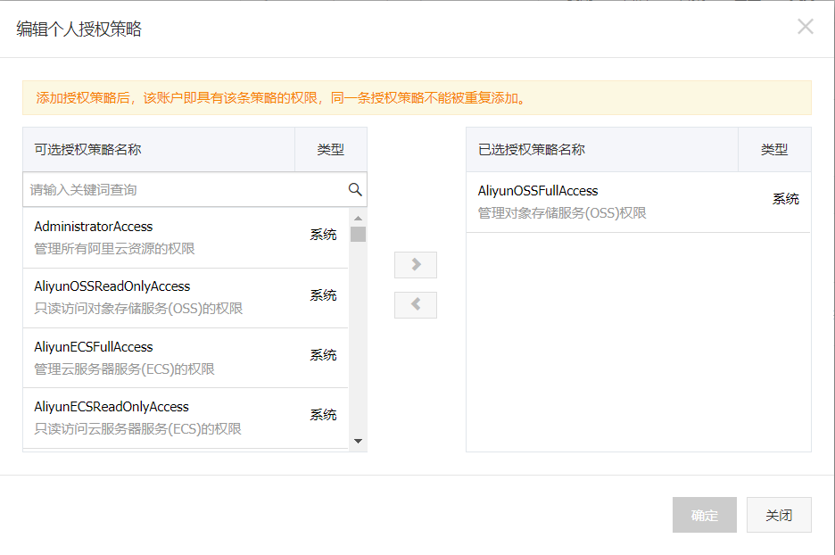

然后我们的存储桶就设置好了

为博客安装阿里云部署插件部署网站
================================

 

这里参考作者

<http://blog.werty.cn/2019/06/hexo/hexo-deployer-ali-oss%E9%83%A8%E7%BD%B2%E5%99%A8%E4%BD%BF%E7%94%A8%E8%AF%B4%E6%98%8E/>

主要内容是

在您的hexo项目目录下执行

 

```powershell 
npm install hexo-deployer-ali-oss --save
```

在hexo项目配置文件_config.yml中添加如下部署配置
```yml
deploy:

type: aliyun

bucket: hexo-blog

region: oss-cn-beijing

accessKeyId: XXXXXXXXXXXXXXX

accessKeySecret: XXXXXXXXXXXXXXXXXXXXXXXXX
```
 

部署的时候只要 `hexo d` 即可

 

这时候你就可以访问你的网站了

<http://ali.intellij.xyz/>

但是这里不是HTTPS访问，这里需要通过在域名管理哪里上传你的证书就可以开启HTTPS访问了

 
=

开启CDN和HTTPS访问
==================

这时候直接访问你的域名会直接算作OSS流量如果开启CDN加速会进一步减少流量费用，还会让你的博客访问速度加快

这时候需要在阿里云的CDN控制台开启CDN加速

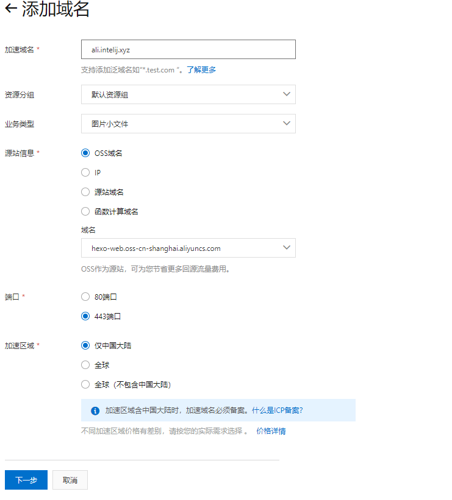

这时候需要将你的域名开启HTTPS访问点击管理

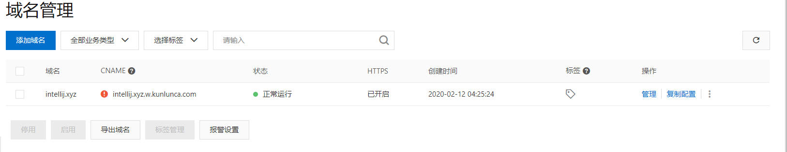

HTTPS内容此下

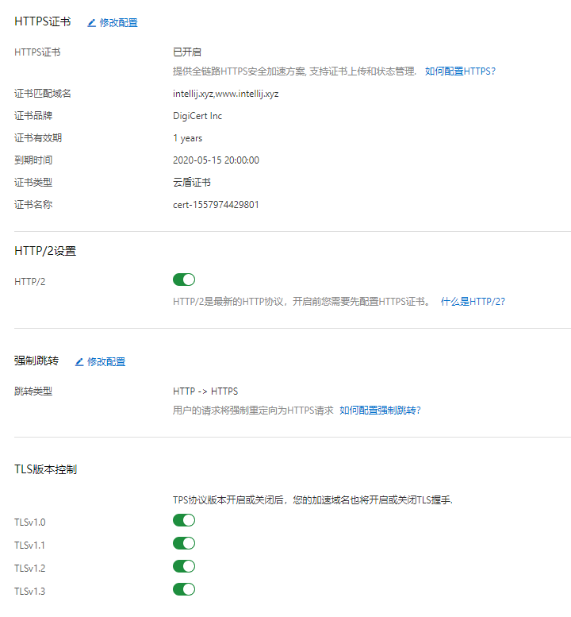
 

回源也开启HTTPS这样就全链路https开启了

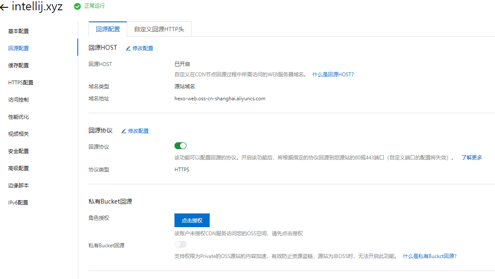

当你设置好之后就可以直接访问你的域名，可以自行查看域名解析内容，当你的网站有全球访问需求的时候可以直接开启全球CDN


以上就是就是我的博客搭建的基本过程