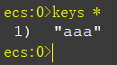
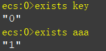
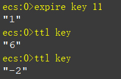
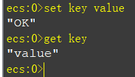
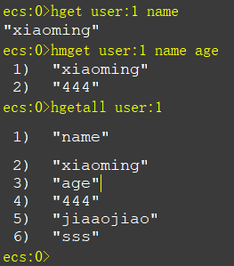
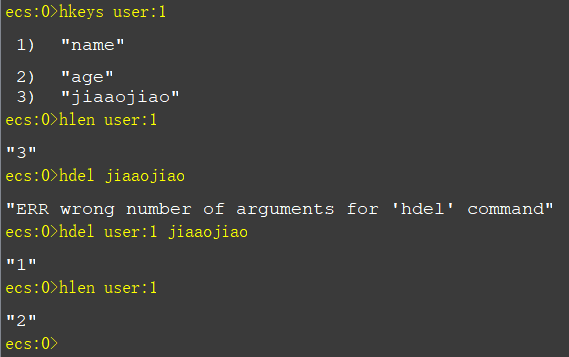

## redis基本命令

**列出所有键：**
```bash
keys *
```



**验证某个key是否存在**
```bash
exists key
```
有就是1，没有就是0




**为key设置过期时间**
```bash
expire key second
```

**查看key的生存时间**
```bash
ttl key
```


| 值          | 意义       |
| ----------- | ---------- |
| -2          | 不存在     |
| -1          | 永远有效   |
| 大于或等于0 | 在有效期内 |

**删除key**
```bash
del key
```

**重命名**
```bash
rename key1 key2
```
**获取类型**
```bash
type key
```

## 生存期的应用场景

- 限时活动
- 数据缓存，积分榜
- 验证码
- 网站的限制访问，一秒n次


## key的命名建议

使用`:`来分割各个字段
举例

user:id:nikename

user:id:password

用户id为0000的昵称key为

user:0000:nikename

## String 类型

- 最大512m
- 二进制安全
- json保存或者单个字符串
- 计数器，原子操作，高并发不会出问题，可以用于统计需求（投票，点赞）

### 设置值

**设置key的值**
```bash
set key value
```
**设置key的值，存在则设置**
```bash
setnx key value
```

**设置key的值，和过期时间**
```bash
setex key 10 value
```
如果不存在则设置值返回1，否则不设置返回0

**替换字符串**
```bash
setrange key offset "stringword"
```
Redis Setrange 命令用指定的字符串覆盖给定 key 所储存的字符串值，覆盖的位置从偏移量 offset 开始。

### 取值

**获取key的值**
```bash
get key
```




**获取分段的值**
```bash
getrange key start end
```
**获取偏移量的位数的值**
```bash
getbit key offset
```

**获取旧的值设置新的值**
```bash
get set key value
```
**获取字符串长度**

```bash
strlen key
```

**批量写**

```bash
mset k1 v1 k2 v2
```

**批量读**

```bash
mget k1 k2
```
**自增**

```bash
incr key
incrby key 10
```

**自减**
```bash
decr key
decrby key 10
```

**字符串拼接**
```bash
append key value
```
将value值拼接到key的末尾


## Hash类型Object

非常适合存储对象，相比json占用更少的时间

### 常用命令

**设置单个值**

```bash
hset user:1 nikename xiaoming
```
这里实测多个值也可以进行设置操作

**设置多个值**
```bash
hmset user:2 nikename lisi age 57
```
**获取单个值**
```bash
hget user:1 nikename
```
**获取多个值**
```bash
hmget user:1 nikename age
```

**返货所有字段和值**
```bash
hgetall key
```


**获取所有hashkey**

```bash
hkeys key
```
**获取字段数量**
```bash
hlen key 
```

**删除某个字段或者多个字段**

```bash
hdel key age [name]
```



**其他命令**
```bash
# 如果不在则设置
hsetnx key name xiaoming
# 增加
hincrby key age 1
# 浮点数增加
hincrbyfloat key money 0.5
# 某个字段是否存在
hexiste key money 
```
### 应用场景和优点
- 常用于存储对象
- 不需要序列化和反序列化
- 减少key的重复，减少内存占用，还有减少存储空间


## Redis内存维护策略

**1.设置超时**

```bash
# 方法一
expire key time
# 方法二 
setex(String key,int second,String value)
```
**2.LRU算法删除不常用的值**
内容策略算法来管理
修改配置文件中的置换策略来修改