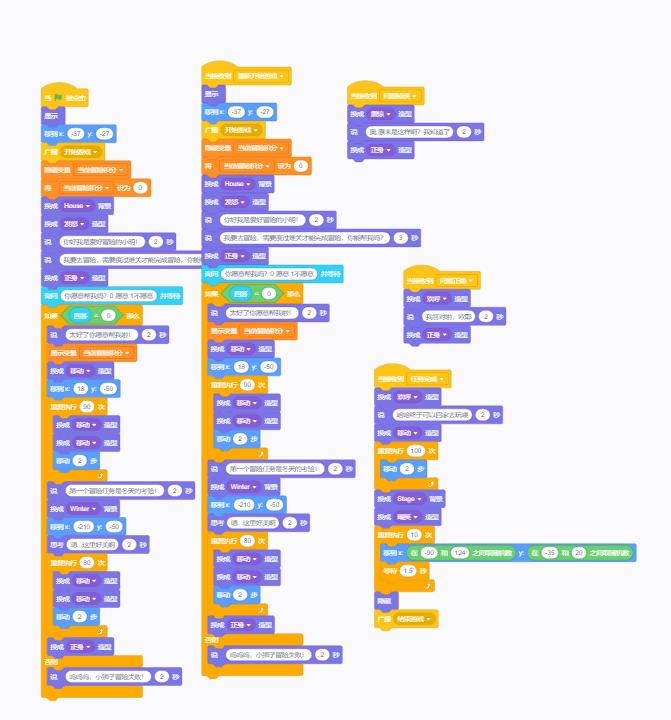
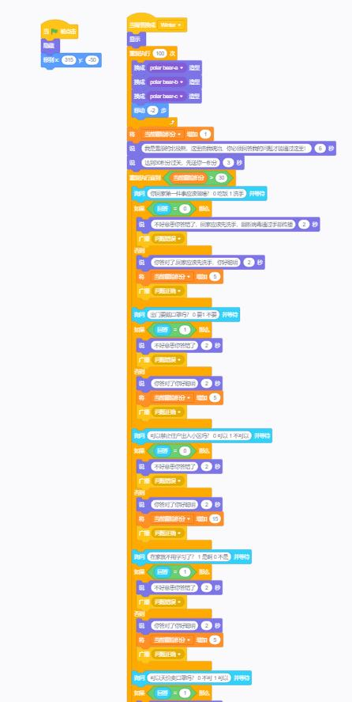
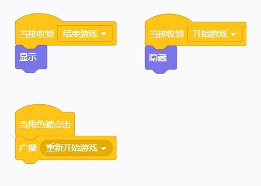
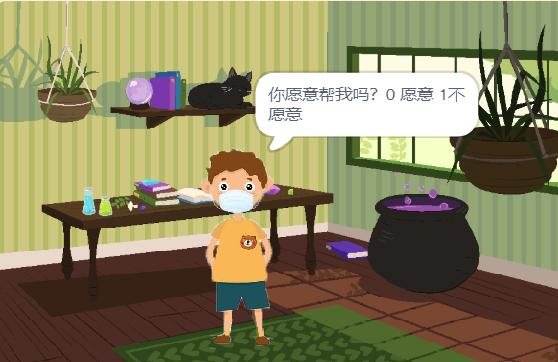
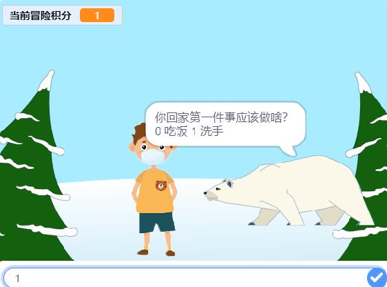
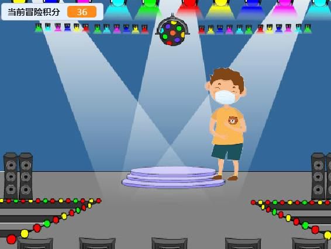
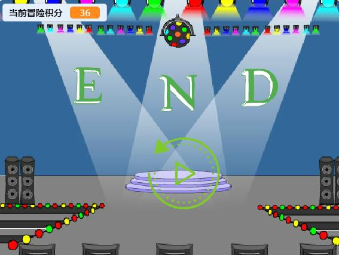

# 少儿编程上手和评价
今天上手体验了一款少儿编程产品，他的名字是Ucode是一款比较小众的少儿编程工具，经过几个小时时间的开发体验，我写下这篇文章做记录。

这是Ucode的[官方文档](https://ubtedu.github.io/uCodeWiki/zh/guide/)这个网上的资料很少，但是只要有一点编程基础就可以轻松上手这个小玩具。

我设计了一款小游戏来体验这个开发：小明是个冒险家，他喜欢冒险，但是由于当前疫情严重所以它在第一关的时候就遇到了拦路的北极熊，他回答出问题才能通过这一关，完成之后玩家可以回家庆祝，也可以选择重新开始游戏。

## 实现部分

贴出代码截图

### 角色代码

### 北极熊

### 三个字母

### 重新玩的按钮

## 游戏截图

开始

答题

回到家庆祝

结束界面，END

## Github下载工程文件

[工程文件](https://github.com/whp98/Ucode_Demo)

## 评价

我觉得少儿编程的小玩意虽然和软件开发没啥关系但是其中的一些高级功能简单易用可以更加的开启儿童的编程思想，确实是不错的产品，尤其是其中还有一部分AI的模块，其简单易用的特点可以让没有语言基础的少儿上手更加简单的可视化编程，并且思想可以直接上升到更加抽象的层面，从而更加清晰的了解程序运行机理，这是很不错的。

一些不足也是可以看出来的，首先这个程序代码没有啥可以移植的方式，这让少儿编程只能停留在玩具层面，这个编程虽然简单但是真实开发环境中比这个复杂得多，而且我发现少儿编程的网上可以参考的内容也比较少，甚至官方文档不是很齐全，这都是少儿编程需要进步的方向，总体来说我是很看好这一个行业的。