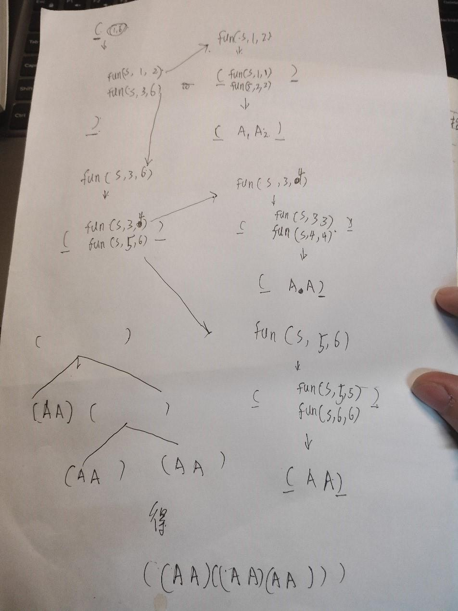

# 动态规划之矩阵链乘法

这个算法的主要目标是降低矩阵连乘的时候的计算量，首先我们可以看一个例子：  
现有三个矩阵A，B，C 需要计算A*B*C 目前已知各个矩阵维数如下：
```
A: 10x5  
B: 5x200  
C: 200x30  

```  

如果采用顺序计算方式即如下算法

```
(A*B)*C
```
那么计算量是`10*5*200 + 10*200*30` = 70000

如果计算顺序如下

```
A*(B*C)
```
那么计算结果是`5*200*30 + 10*5*30` = 31500

可以看出来通过在算式中加括号来改变计算顺序可以极大的降低计算量，上面的例子中我们通过改变计算顺序就降低了一半多的计算量。  
这时候我们可以知道加括号有用那么我们如何加入括号，如果使用暴力算法求解在各个位置加入括号的效果然后加入括号是否可行呢，那么我们来试试看

比如我们需要计算两个矩阵相乘的时候可以有一种乘法方案，但是一旦超过2那么我们就面临着一个指数级别的排列组合问题(n<sup>2</sup>)，从这里我们就可以知道穷举法根本不适合解决此问题,因为我们不但要找出所有排列组合还要对没种组合求解，计算量和复杂度都比较超标。  
好在我们有比较高明的动态规划算法来解决此类问题

## 如何使用动态规划来解决此类问题呢
动态优化问题,注重研究如何让利用额外的内存空间，来存储那些可能会产生重复的计算结果，然后在每次计算中会直接使用已经计算出来的结果，不做重复的计算步骤

## 通过动态规划算法来得到矩阵链乘的最优括号化结果

下面通过一个矩阵链乘的最优括号化的问题的实例计算来说明一下：

1)	对维数为序列<5, 10, 3, 12, 5, 50, 6>的各矩阵，找出其矩阵链乘积的一个最优加全部括号。

### 计算步骤
根据公式分别计算m表和s表并且记录下来


### 根据s表得出结果


## 总结
从上面的实例计算可以分析出可以用动态规划解决的问题的类型，是有大量重复的计算的步骤。通过保存这些需要反复计算的内容，可以减少进一步计算的计算量这就是动态规划问题的特点，我们需要抓住该类问题的特点进行处理。