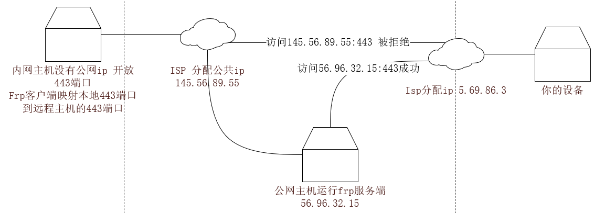
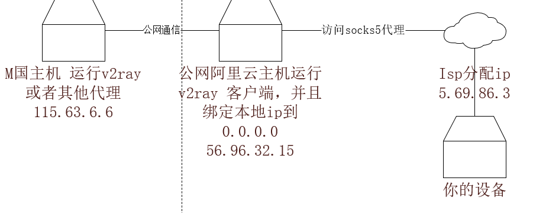

# 中转方案,最适合学生的科学上网方案

学生科学上网主要是利用外网丰富的资料，快速的解决自己的问题，最重要的一点就是快速和稳定，不想在一次次的风波中，
突然不能上网影响自己的工作效率。而且上网内容也是合法的不会去发表啥不当言论啥的，所以并没有啥很迫切的掩人耳目的需求。

而且基本上每个学生都有中国国内的主机包括vps或者云主机，这类机器的特点就是连接外网比较稳定丢包率比较低，虽然国内的主机带宽不是很高但也基本够用。

本文只是介绍我个人用起来很稳定的方案，并不会介绍具体的搭建内容，毕竟肉身在国内这个应该不能教。

## 方案一：使用内网穿透工具转发以frp为例

这个是我之前使用的方案，还是比较稳定的，我不知道读者有没有接触过内网穿透工具，我用一张图来说明其工作原理，如下图：

也就是说没用公网ip的主机是不能被外网访问的，但是中间有个公网的主机运行内网穿透服务就可以做到将本地的主机映射的公网主机的某个端口，然后我们访问公网主机就可以得到内网主机的服务了。

我就是想表达使用这个原理来实现使用国内主机来映射国外代理服务端口。利用云服务器连接外网的丢包率低，并且不易被检测的优势，来保证我们的代理服务质量提升。

这个原理是比较通用的，我发现这个还是很稳定的，利用国内云服务商的ip优势可以实现比较长时间的稳定服务。

下面展示实战图搭建的原理图：

其中M国主机只是一个代称，要看你的机房在哪，ip和端口只是举个例子，都是瞎打的，要注意你自己的设备连接的时候要连接你的中转服务器和ip和端口。

### 好处

这个方式很通用，无论你用任何代理，只要端口固定就可以实现这个中转，你不用担心你的isp会限制你链接外国ip的速度从而产生很多的丢包，因为一般的云服务厂商比如阿里云都会提高三大运营商的连接质量，唯一的风险就体现在你的阿里云主机和M国主机的连接上，不过经过我的亲身体验这个是很稳定的，很长一段时间之后我也没觉得会变卡，而且你和代理服务器建立的连接也是比较少的，只有一条连接，我觉得这个方案还是比较不错的。可以总结为：通用，简单，稳定。

## 方案二：让国内云主机当客户端 "分布式代理"

哈哈，这个就是在云主机上运行代理客户端，利用当前代理客户端都会在本地运行一个比较初级的代理的特点来进行。

比如，你在本地运行了v2ray客户端你就会发现他会在本地启动一个socks5代理，你可以在各种支持代理的软件里面输入 ip 127.0.0.1  端口 1080 这个时候这个代理是绑定在本地回环ip上的，当你将这个绑定的ip改成 0.0.0.0 你就会发现局域网内的设备也能访问这个socks5代理了，如果你直接将代理运行在你的树莓派上，这时候你的笔记本可以直接连接socks5代理不会在你的笔记本上进行v2ray的加密和解密了，提高了设备的利用率，不过这次我们的客户端运行在阿里云主机上而不是你的设备上。

这里我们拿trojan来举例，我们平时不是直接使用 trojan.exe 还有 config.json 还有 fullchain.cer 这三个文件在电脑上使用吗，我们只要做一个简单的改动就可以了，将config.json中的 127.0.0.1 改成 0.0.0.0 然后下载一个linux版的trojan 可执行文件，将三个文件弄到阿里云上直接nohup 运行

我们将浏览器的代理地址改成阿里云的ip 端口改成 默认的1080 （或者你自己设定的端口） 我们就会发现可以直接上网了，并且比之前更快而且稳定性不必上面那个方法差。

至于v2ray的操作，我只能说大同小异。

原理图如下：

### 好处

自从用上第二个方法，我腰不酸了腿不疼了，干啥都有劲了😂。

总结：简单，高效，稳定，速度快。

小彩蛋：这个你可以v2ray的客户端使用，点击添加，选择socks5，这样你就可以开启http代理和全局代理了，v2ray的功能也都能用的上了。

## 总结

上面的方式并不适合小白使用，他要求你有两台公网主机，一台国内一台国外，但是搞过代理的学生朋友应该一看就会，具体细节我并不多说，毕竟别人写的各种教程比我说的好多了。如果你实在有困难，请使用google自行搜索v2ray和trojan的搭建和使用教程。