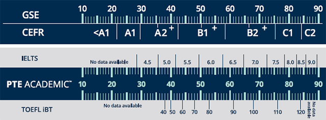
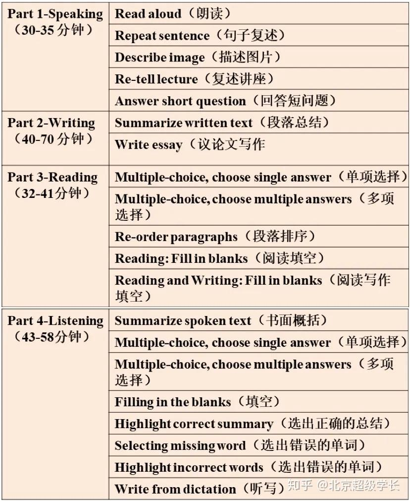

# PTE考试

PTE学术英语考试（Pearson Test of English Academic）
特点是使用ai电脑评分，避免考官主观评分带来的不公平。
考试费用275美元，考试地点很多，由于使用电脑评分，可以通过类似的评分系统进行练习。
## 成绩对照表

## 考试地点

https://www.pearsonpte.com.cn/china-test-centers

## 考生手册

https://www.pearsonpte.com.cn/test-taker-handbook

## 考试题型

## 考试练习

https://ptego.com/ch

https://www.ytaxx.com/

https://www.apeuni.com/

https://pteplus.com.cn/

https://pte.netlify.app/listening/1-summarize-spoken-text

## 课程

bilibili 搜索 pte考试
